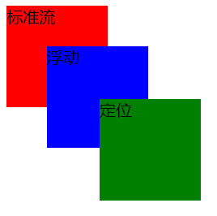
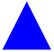
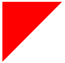

### 行，块，行内块元素都有哪些

**行内元素：**span、a、  
<span style="    font-size: 12px;
    line-height: 10px;
    color: #878787;">注意：行内元素设置margin的上下高度是无效的<br>padding的上下高度只会影响边框和背景</span>

**块级元素：**p、div、form、hr、h1~h6、

**行内块元素：**img、select、textarea、input、video、button


### flex布局

> 容器属性

1. flex-direction（主轴方向）  
    row（默认）：主轴为水平方向，起点在左端。  
    row-reverse：主轴为水平方向，起点在右端。   
    column：主轴为垂直方向，起点在上沿。  
    column-reverse：主轴为垂直方向，起点在下沿。   

2. flex-wrap（换行）  
    nowrap（默认）：不换行（设置的项目的宽度就失效了，强行在一行显示）。  
    wrap：换行。  
    wrap-reverse：换行，第一行在下方。  

3. flex-flow（方向 换行）  
    flex-direction和flex-wrap的简写。默认值为row nowrap。

4. justify-content（主轴对齐方式）  
    flex-start（默认）：左对齐。  
    flex-end：右对齐。  
    center：居中。  
    space-between：两端对齐，项目之间的间隔都相等。  
    space-around：每个项目的两侧间隔都相等，所以项目之间的间隔比边框大一倍。  

5. align-items（交叉轴对齐方式，上下高度对其）  
    flex-start：交叉轴的起点对齐，顶部对齐。  
    flex-end：交叉轴的终点对齐，底部对齐。  
    center：交叉轴的中点对齐。  
    baseline：项目的第一行文字的基线对齐。  
    stretch（默认）：如果项目未设置高度或设auto，将占满容器的高度。 

6. align-content（多轴对齐方式。如果项目只有一根轴线，该属性不起作用）   
    flex-start：交叉轴的起点对齐，顶部对齐。  
    flex-end：交叉轴的终点对齐，底部对齐。  
    center：交叉轴的中点对齐。  
    space-between：与交叉轴两端对齐，轴线之间的间隔平均布局。  
    space-around：每根轴线两侧的间隔都相等。项目之间的间隔比边框的间隔大一倍。  
    stretch（默认值）：轴线占满整个交叉轴。


> 项目属性

1. order（排列顺序，默认0）   
    项目的排列顺序，数值越小越靠前，默认为0。可负数

2. flex-grow（放大比列，默认0）  
    项目的放大比列，默认为0，如果存在剩余空间，也不放大。
    如果所有项目属性值都大于0并相同，则他们将等分剩余空间。

3. flex-shrink（缩小比列，默认1）  
    项目的缩小比列，默认为1。  
    属性为0时，将不会缩小，负值无效。  

4. flex-basis（项目占据固定大小）  
  定义有多余空间，项目占据的主轴空间大小，默认为auto（原本的大小）。  
  可以设置和宽高一样的属性，px，%，vh都可以用。  

5. flex（放大 缩小 大小三属性的缩写）  
  flex-grow，flex-shrink，flex-basis的简写，默认为0 1 auto，后两个可选。  

6. align-self（允许单个项目有不一样的对齐方式）   
    auto：继承父元素的align-items属性。  
    flex-start：交叉轴的起点对齐，顶部对齐。  
    flex-end：交叉轴的终点对齐，底部对齐。  
    center：交叉轴的中点对齐。  
    baseline：项目的第一行文字的基线对齐。  
    stretch（默认值）：如果项目未设置高度或设auto，将占满容器的高度。  


### BFC布局

bfc：其作用是使内部元素的布局不受外部元素影响。

**BFC的触发条件**
+ 根元素，也就是html根标签
+ position：fixed/absoluted
+ float属性值不是none的
+ overflow属性值不是visible的
+ display属性值：inline-display/table-cell/table-caption/flex/inline-flex;

**BFC的作用**
+ bfc内部元素的布局不受外部元素影响。
+ bfc区域不会出现margin重叠
+ bfc区域计算高度时候会自动计算浮动元素
+ bfc区域不会和浮动元素重合


### css垂直居中

+ 方式1：绝对定位

  ```css
  porentElement{
      posotion:relative;
  }
  childElement{
      position:absolute;
      top:50%;
      left:50%;
      transform: translate(-50%,-50%);
  }
  ```

+ 方式2：flex布局

  ```css
  parentElement{
      display:flex;
      align-items: center;
      justify-content: center;
  }
  ```


### 左右固定，中间实现自适应

**1. float实现**

```html
<div>
    <div style="float: left;width: 200px;">left</div>
    <div style="margin: 0 200px;">middle</div>
    <div style="float: right;width: 200px;">right</div>
</div>
```

**2. flex实现**

```html
<div style="display:flex;">
    <div style="width: 200px;">left</div>
    <div style="flex:1;">middle</div>
    <div style="width: 200px;">right</div>
</div>
```


### position有哪些属性

1. absolute:绝对定位；根据有定位的父元素为基准进行定位，脱离文档流，不占用原来的位置。
2. relative：相对定位；根据自身为基准点进行定位，不脱离文档流，只改变自身的位置，还是会占用原来的位置。
3. fixed：固定定位；类似absolute，但不随滚动条的位置而改变。
4. static：默认值；默认布局（使用z-index无效）。


### css定位和层级
1. z-index只有设置了定位才能生效（设置static默认定位是无效的）
2. 层级一样的情况下，后者的元素会覆盖前者。
3. 标准 < 浮动 < 定位



### 消除浮动

**产生原因：**  
1. 当父元素不给高度的时候；  
2. 子元素设置了float浮动属性；

**解决方案：**  
1. 在标签的最后位置添加一个div标签，设置``clear: both;``  
2. 给父元素添加overflow属性  
3. 让父级元素也浮动  
4. 给邻接元素添加``clear:both; `` 
5. 给父级设置after元素，设置  
   ```css
   .clearfix:after{
     content: "";
     display: block; 
     height: 0; 
     clear: both; 
     visibility: hidden;  
   }
   ```

### 伪类和伪元素的区别

伪类：特殊的class选择器，或是用来添加一些特殊效果。（只能使用单冒号）

伪元素：为选中的元素添加指定的内容。（可以使用双冒号）


<!-- 伪类： -->

| 伪类                    | 作用                                        |
| ------------------------| -----------------------------------------  |
| :active                 | 将样式添加到被激活的元素                     | 
| :focus                  | 将样式添加到被选中的元素                      | 
| :hover                  | 当鼠标悬浮在元素上方时，向元素添加样式         | 
| :link                   | 将特殊的样式添加到未被访问过的链接             | 
| :visited                | 将特殊的样式添加到被访问过的链接              | 
| :first-child            | 将特殊的样式添加到元素的第一个子元素           |
| :lang                   | 允许创作者来定义指定的元素中使用的语言         | 

<!-- 伪元素： -->
| 伪元素               | 作用                                        |
| ---------------------| -----------------------------------------  |
| :first-letter        | 将特殊的样式添加到文本的首字母                | 
| :first-line          | 将特殊的样式添加到文本的首行                  | 
| :before              | 在某元素之前插入某些内容                      | 
| :after               | 在某元素之后插入某些内容                      | 


### 盒子模型是什么

盒子模型由四个部分组成： 

margin（外边距）， border（边框），padding（内边距），content（内容）

如果就想用设置宽高来当总体的宽高度 ，就设置一个``box-sizing：border-box；``


### CSS实现一个三角形

https://www.cnblogs.com/lidaying5/p/12605809.html

```css
#triangle-up {
    width: 0;
    height: 0;
    border-left: 50px solid transparent;
    border-right: 50px solid transparent;
    border-bottom: 100px solid blue;
}
```



```css
#triangle-topleft {
    width: 0;
    height: 0;
    border-top: 100px solid red;
    border-right: 100px solid transparent;
}
```




### 重绘和回流

回流：引起DOM树结构变化，页面布局变化的行为叫回流,且回流一定伴随重绘。

重绘：只是样式的变化，不会引起DOM树的变化，页面布局的行为叫重绘，且重绘不一定会伴随回流。

