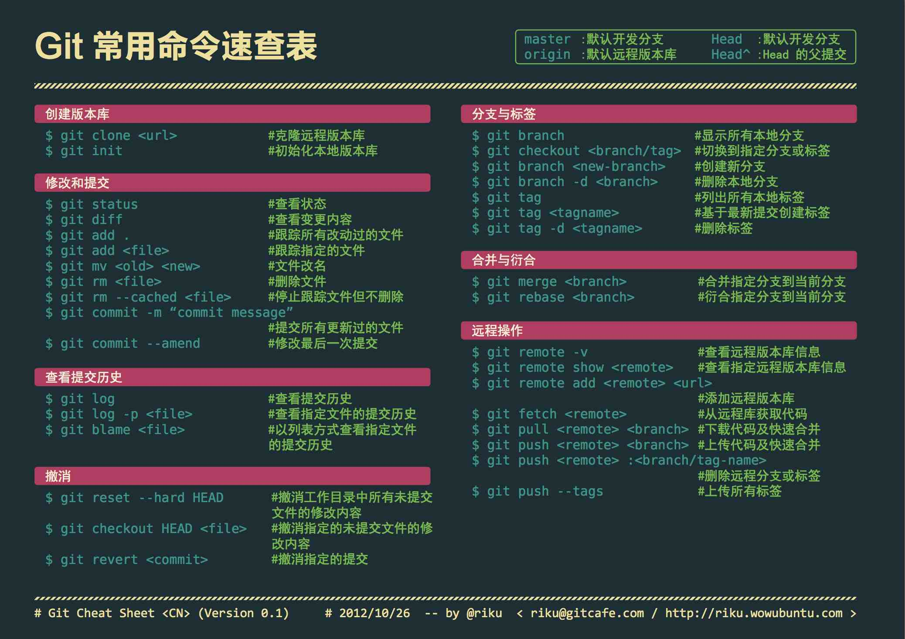
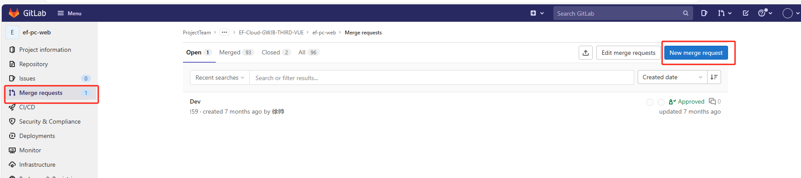
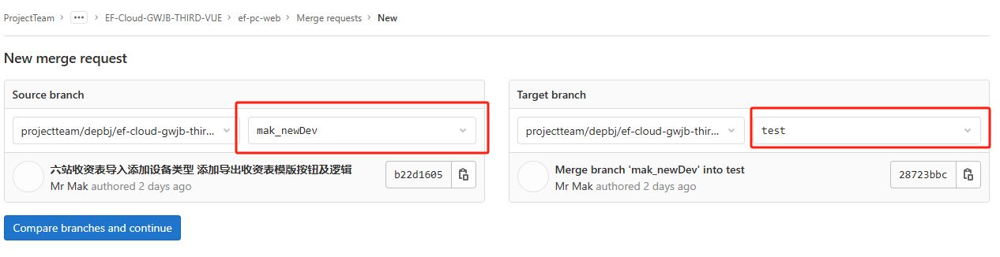
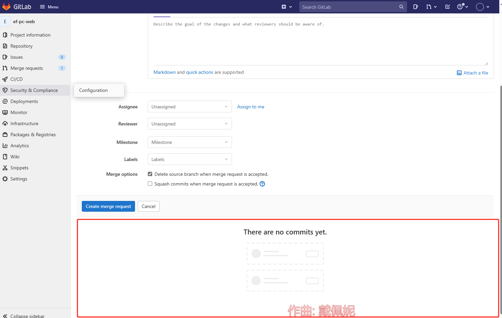
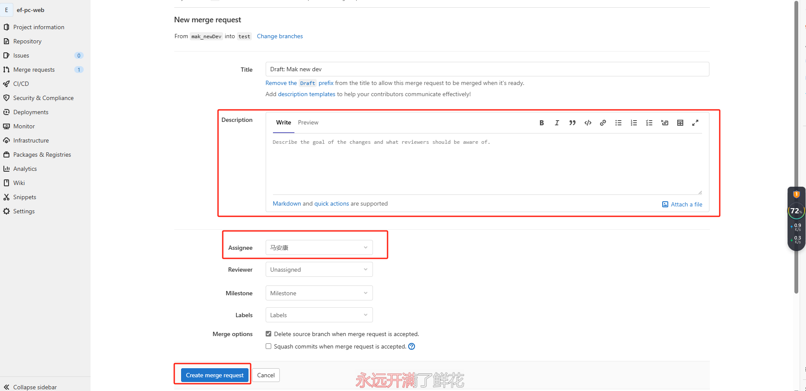
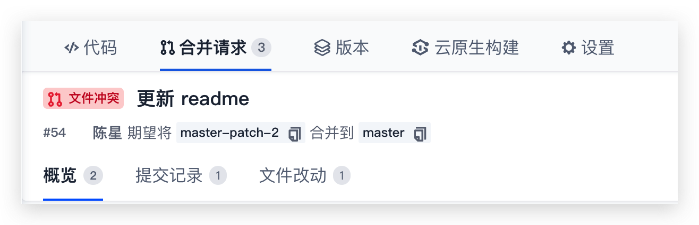
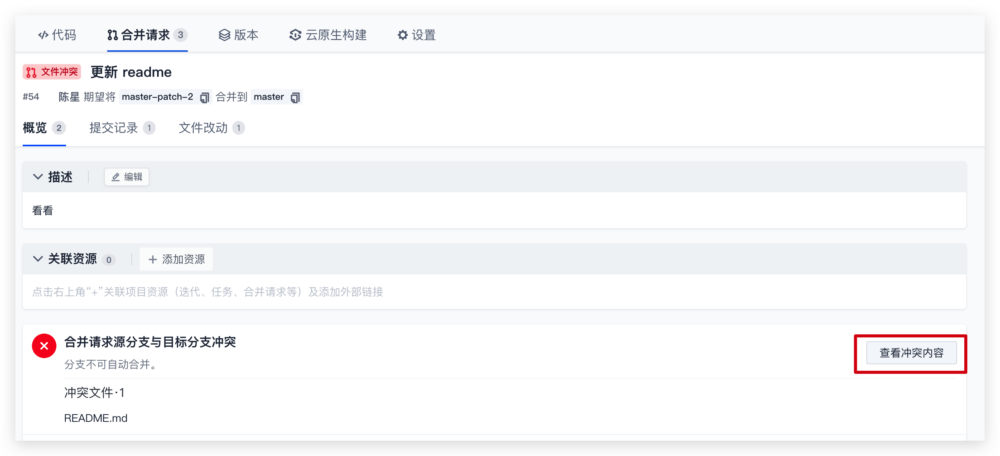
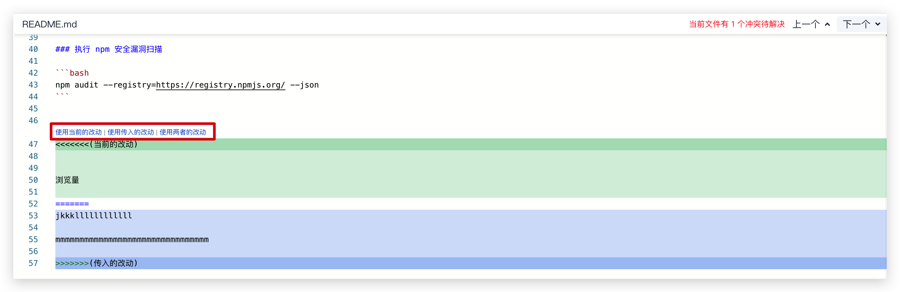

> 本使用说明旨在规范团队成员在使用Git进行版本控制时的操作行为，以确保代码库的清晰、整洁和可维护性。请所有团队成员遵循以下建议。

+ dev(dev)：分支用于合并新功能和修复bug。  
+ master(main)：分支则是用于稳定版本发布。



## 一、新功能开发流程

### 1. **拉取最新代码**：
   - 在开始新功能开发之前，从`dev`分支拉取（pull）最新的代码。这确保你的工作基于最新的代码库进行。

   ```bash
   git checkout dev
   git pull origin dev
   ```

### 2. **创建新特性分支**：
   - 基于`dev`分支，创建一个新的特性分支（feature branch）。这个分支将用于开发新功能。分支名应简洁明了，通常包含功能名称或相关描述。

   ```bash
   git checkout -b feature/new-feature-name
   ```

### 3. **开发新功能**：
   - 在新特性分支上进行新功能的开发工作。确保遵循团队的编码规范和最佳实践。

### 4. **提交更改**：
   - 在开发过程中，定期将更改提交到本地Git仓库。每次提交都应包含有意义的提交信息，描述所做的更改。

   ```bash
   git add .  # 或者只添加特定文件
   git commit -m "提交信息：描述所做的更改"
   ```

### 5. **合并到`dev || test`分支**：
  - 在代码仓库详情页面，点击“New Merge Request”或相似的按钮开始创建合并请求
  
  - 指定合并请求的源分支与目标分支。点击Compare branches and continue进行下一步填写相关合并信息
  
  - 创建合并请求后还可以在“提交记录”页分别查看本次请求中的所有提交历史与单次推送中包含的所有提交记录检查是否无误。
   
  - 填写相关内容。`Description`：填写本次合并内容有哪些，`Assignee`：代码规范审查人 Assignee：选择`马安康` 特殊情况选择`张达`，填写完毕后点击Create merge request提交本次合并请求 由审查人审核代码
  
   <!-- - 当你完成新功能的开发工作后，需要将它合并到`dev`分支。在合并之前，请确保你的本地代码库是最新的（通过拉取操作）。然后，将你的特性分支合并到`dev`分支。

   ```bash
   git checkout dev
   git pull origin dev  # 确保dev分支是最新的
   git merge feature/new-feature-name
   ``` -->

   <!-- 如果合并过程中出现冲突，请手动解决冲突后再进行提交。 -->
### 6. **解决合并冲突**：
 - 造成合并冲突的原因是源分支与目标分支对相同的代码做出了不一致的变更。发起合并请求时将自动比对源分支与目标分支的内容差异，若发现存在冲突内容，系统将提示源分支和目标分支不可自动合并，你可以通过在线或本地两种方式解决冲突后继续发起合并请求。
   
#### 在线解决冲突
 -  遇到代码冲突的情况往往需要在本地终端中反复拉取并解决，然后再推送至远端仓库中。在线解决冲突功能让繁琐的步骤 简化为简单的鼠标操作，点击网页中的“查看冲突内容”按钮便能够在线预览相冲突的内容。
   
 -  冲突内容将会被高亮展示，此时选择需要保留的内容。点击右上角的切换按钮快速切换至其他冲突的所在行，解决所有冲突后轻点“提交改动”按钮提交变更，此时将在代码仓库中产生一个新的提交记录。
   
#### 本地解决冲突
 -   例：当 branch-01 合并入 test 分支时提示有冲突时，可以先在本地切换至 test 分支并运行命令：
     ```bash
     git merge branch-01
      ```
  -  找到冲突文件，此时冲突文件会标识冲突内容并询问保留何种内容。选择需保留的内容，保存后重新提交 commit，完成后切换至 branch-01 分支并输入命令：
     ```bash
    git merge master
      ```
  再将修改后的代码推送至远端仓库即可。
### 7. **删除特性分支**：
   - 合并完成后，你可以删除本地的特性分支（如果不再需要）。

   ```bash
   git branch -d feature/new-feature-name
   ```

   同时，也可以考虑删除远程仓库上的特性分支（如果其他团队成员不需要再访问它）。

   ```bash
   git push origin --delete feature/new-feature-name
   ```

### 8. **单个分支建议**：
   - 建议为每个新功能或修复任务创建单独的分支。这有助于保持代码的模块化和可维护性。每个分支应专注于实现一个特定的功能或修复一个特定的问题。


## 二、提交规范

1. **禁止上传无关文件**：
   - 请确保提交到Git仓库的文件与项目直接相关，避免上传如配置文件、日志文件、临时文件、个人数据等无关文件（提交前务必对比自己更改的内容）。

2. **提交备注**：
   - 提交信息应简洁明了，能够清晰地描述所做的更改。建议使用以下格式：
     ```
     示例：
     1.feat: 新增功能（feature）
     git commit -m "feat: add new feature X"

     2.fix: 修复 bug
     git commit -m "fix: resolve issue with Y"

     3.docs: 更新文档
     git commit -m "docs: update README"

     4.style: 代码风格的变化，不影响代码逻辑
     git commit -m "style: format code according to style guide"

     5.refactor: 代码重构，不是新增功能也不是修复 bug 的代码变动，可以是注释的调整 log：
     git commit -m "refactor: improve variable naming"

     6.test: 添加或修改测试代码
     git commit -m "test: add unit tests for component X"

     7.chore: 对构建过程或辅助工具和库的更改
     git commit -m "chore: upgrade dependencies"

     8.ci: 对 CI 配置文件和脚本的更改
     git commit -m "ci: configure Travis to run tests"

     9.ci: 对 CI 配置文件和脚本的更改
     git commit -m "perf: optimize algorithm for faster processing"
     ```
3. **提交内容**：
   - 切忌一次大量提交代码，尽量将相关的更改拆分成多个小提交。
   - 禁止大面积格式化代码，这会导致在对比代码时难以查找出实际修改的内容。

## 三、操作建议

1. **拉取代码**：
   - 在提交代码之前，务必先拉取（pull）最新的代码，以避免合并冲突。
   - 如果遇到合并冲突，请手动解决冲突后再提交。

2. **提交到本地**：
   - 每次修复一个功能或实现一个新功能后，都应及时将更改提交到本地仓库。
   - 可以不立即推送到远程仓库，但建议定期（如每天下班前）将本地仓库推送到远程仓库。

3. **分支管理**：
   - 为每个新功能或修复任务创建一个单独的分支，并在该分支上进行开发。
   - 开发完成后，将分支合并到主分支（如master或main）上，并进行必要的测试和审查。

4. **强制提交**：
   - 一般情况下不得强制提交（force push），因为这可能会覆盖其他团队成员的更改。
   - 如果确实需要强制提交，请确保与其他团队成员充分沟通，并了解可能的影响。

5. **提交说明**：
   - 提交信息应包含有意义的说明，避免无意义或模糊的提交信息。
   - 如果有必要，可以在提交信息中包含相关的问题跟踪系统ID或链接。

## 四、其他建议

1. **定期同步**：
   - 鼓励团队成员定期同步代码库，确保自己的代码库是最新的。

2. **代码审查**：
   - 鼓励团队成员之间进行代码审查，以提高代码质量和可维护性。

3. **学习与实践**：
   - 鼓励团队成员学习和掌握更多的Git知识和技巧，以提高工作效率和团队协作能力。

请遵循以上建议，共同维护一个清晰、整洁和高效的代码库。如有任何疑问或建议，请随时与团队成员或项目负责人沟通。

## 五、开发提交几种状况

### 有一个紧急bug需要发版
如果你有一个新功能和一个需要立即修复的bug，并且这个bug需要立即发版，以下是你应该遵循的步骤：

1. **修复紧急bug**：
   - 从 `master` 分支拉取最新代码。
   - 创建一个新的修复分支（例如 `hotfix/bug-fix-name`）。
   - 在修复分支上修复bug。
   - 提交并推送修复分支。

2. **合并到 `master` 并发布**：
   - 将修复分支合并到 `master` 分支。
   - 通过CI/CD流程进行构建、测试和部署。
   - 如果一切顺利，发布到生产环境。

3. **合并到 `dev`分支**：
   - 一旦 `master` 分支上的bug修复被验证并发布，你应该将相同的修复合并到 `dev` 分支，以保持 `dev` 分支与 `master` 分支同步。

4. **处理新功能**：
   - 回到你的新功能开发，继续按照之前描述的开发流程操作。
   - 在新功能开发完成后，将其合并到 `dev` 分支进行测试。
   - 等待适当的时候，将 `dev` 分支上的新功能合并到 `master` 分支并发布。

注意：

- 直接向 `master` 分支提交更改通常是不推荐的，除非你正在进行紧急修复或非常小的改动。通常，你应该始终通过特性分支或修复分支来操作，然后将它们合并到 `dev` 或 `master` 分支。
- 与你的团队成员和项目管理人员保持沟通，确保他们了解当前的进度和任何可能影响发布的更改。

### 多人提交找到单个提交并发版
如果你的 `dev` 分支上依次提交了三次发版。①新内容、②修复bug、③新内容。但现在你只需要发布②修复bug的版本，有几种方法可以实现：

#### 方法一：使用 `git revert` 回退不需要的提交

你可以使用 `git revert` 来创建一个新的提交，该提交会撤销 `dev` 分支上不需要的新内容提交。但请注意，这并不会改变历史，而是会添加一个新的提交来撤销之前的更改。

1. **查找不需要的提交的哈希值**：
   使用 `git log` 命令查看提交历史，找到不需要的新内容提交的哈希值。

2. **回退不需要的提交**：
   针对每个不需要的提交，使用 `git revert` 命令创建一个新的提交来撤销它。

   ```bash
   git checkout dev
   git revert <commit-hash-of-unwanted-feature-1>
   git revert <commit-hash-of-unwanted-feature-2>
   ```

   这里 `<commit-hash-of-unwanted-feature-1>` 和 `<commit-hash-of-unwanted-feature-2>` 是你不想要的新内容提交的哈希值。

3. **解决冲突（如果需要）**：
   如果回退过程中产生冲突，你需要手动解决它们。

4. **测试**：
   确保你的 `dev` 分支现在只包含了你想要发布的bug修复。

5. **合并到 `master`分支**：
   将 `dev` 分支合并到 `master` 分支，并进行发布。

#### 方法二：使用 `git cherry-pick` 单独选择bug修复提交

如果你知道bug修复提交的哈希值，你可以使用 `git cherry-pick` 命令来单独选择这个提交，并将其应用到一个新的分支上，然后从这个分支发布。

1. **创建一个新的发布分支**：
   基于 `master` 分支创建一个新的发布分支。

   ```bash
   git checkout -b release-branch master
   ```

2. **cherry-pick bug修复提交**：
   使用 `git cherry-pick` 命令将bug修复提交应用到新的发布分支上。

   ```bash
   git cherry-pick <commit-hash-of-bug-fix>
   ```

   这里 `<commit-hash-of-bug-fix>` 是bug修复提交的哈希值。

3. **测试**：
   确保你的发布分支上只包含了你想要发布的bug修复。

4. **合并到 `master`分支**：
   将发布分支合并到 `master` 分支，并进行发布。

#### 方法三：重置 `dev` 分支并重新应用提交

这是一个更激进的方法，它涉及到重置 `dev` 分支的历史，并只保留你想要的提交。但请注意，这会改变 `dev` 分支的历史，并可能导致与其他开发者的冲突。

1. **重置 `dev` 分支**：
   使用 `git reset` 命令将 `dev` 分支重置到一个旧的提交（即bug修复之前的提交）。

   ```bash
   git checkout dev
   git reset --hard <commit-hash-before-bug-fix>
   ```

   这里 `<commit-hash-before-bug-fix>` 是你想要重置到的提交的哈希值。

2. **重新应用bug修复提交**：
   使用 `git cherry-pick` 或手动应用bug修复更改。

3. **（可选）重新应用其他必要的提交**：
   如果你还需要 `dev` 分支上的其他提交，你可以继续使用 `git cherry-pick` 或其他方法将它们应用回来。

4. **测试**：
   确保你的 `dev` 分支现在只包含了你想要的内容。

5. **（如果需要）合并到 `master`分支**：
   如果你决定从 `dev` 分支发布，而不是从新的发布分支发布，你可以直接将 `dev` 分支合并到 `master` 分支。

!>  在选择哪种方法时，请考虑你的团队习惯、项目的历史和当前的协作状态。如果你与其他开发者共享 `dev` 分支，并且他们可能已经有基于当前 `dev` 分支的本地更改或分支，那么重置 `dev` 分支可能会导致问题。在这种情况下，使用 `git revert` 或 `git cherry-pick` 可能是更好的选择。