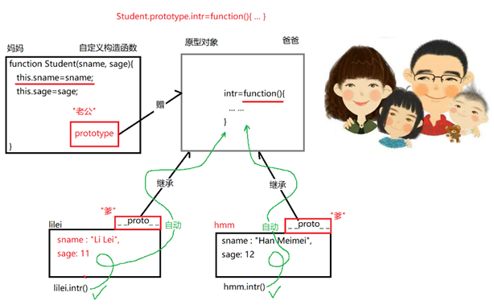
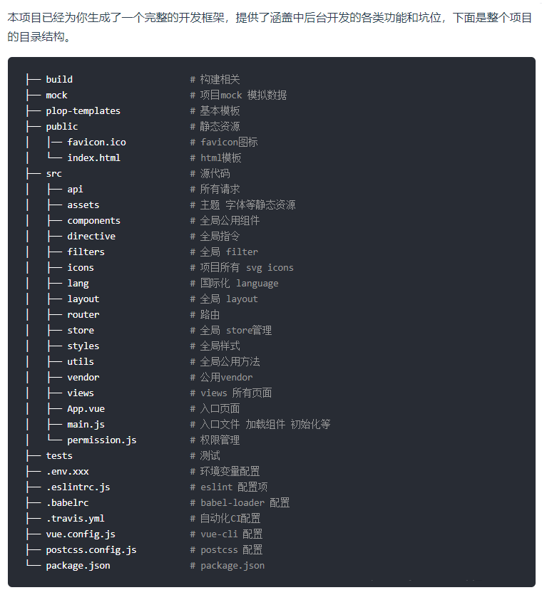

###  promise和await/async的区别

区别主要在于按顺序调用多个 异步函数 时的写法 和报错获取 


```javascript
ajax().then(fun1).then(fun2).then(fun3).then(fun4)
```

await/asycn方法

```javascript
async function  demo(){
    await res=aiax();
    await res=fun1(res);
    await res=fun2(res);
    await res=fun3(res);
    await res=fun4(res);
}
```

总结：

+  当遇到多个异步函数时
  + Promise方法需要很多.then，会导致代码不宜读且结构复杂
  + await/async方式让异步代码的格式于同步代码一样，更易读
+ 报错读取
  + Promise使用 .catch抓取
  + await/async使用try...catch...方式抓取错误

 

### 同步和异步
**同步**: 先执行完当前行内容，然后再执行下一条内容，会阻止后续代码执行，通过返回值获取结果  
**异步**: 把要执行的内容以回调函数形式放入到事件队列，不会阻止后续代码执行，通过回调函数获取结果  

### Promise对象
Promise 是异步编程的一种解决方案    
Promise接收两个参数，resolve, reject  
promise是同步，then是异步  

**Promise 的基本使用**
1. then 链式操作，正确时执行
2. catch 链式操作，错误时执行（如果执行resolve的回调出错，也会执行catch）
3. finally 不管最后的状态如何，都会执行的操作
4. all 所有的接口请求完毕后才会执行回调（只要有一个接口失败就走catch）(结果是数组，按照接口请求顺序排序)
5. race 所有的接口，谁第一个执行完毕就执行回调（和all类似，all是执行完所有，race是执行完第一个）

  **其中一个promise出错，如何保证all执行**  
  在promise.all队列中，使用map滤每一个promise任务，其中任意一个报错后，return一个返回值，确保promise能正常执行走到.then中
  ```js
    var p1 = new Promise((resolve, reject) => {
      resolve('p1');
    });
    var p2 = new Promise((resolve, reject) => {
      resolve('p2');
    });
    var p3 = new Promise((resolve, reject) => {
      reject('p3');
    });
    Promise.all([p1, p2, p3].map(p => p.catch(e => '出错后返回的值' )))
      .then(values => {
        console.log(values);
      }).catch(err => {
        console.log(err);
      })
  ```

###  简述ES6使用到的新语句

1. let：块级作用域，不能重复声明，没有变量提升
2. const：常量；声明必须赋值，声明后的**基本数据类型无法被篡改**，引用类型可修改
3. 模板字符串
4. 解构赋值：let {name,age}={name:'dongdontg',age:33}
5. ... ：扩展运算符，代替arguments变量，接受函数的多余参数。function name(...age){}
6. 箭头函数：匿名函数，this永远指向其父作用域，不能用new创建，不能使用arguments
7. Promise：异步编程的一种方案，解决回调地狱
8. class 面向对象


###  什么是单页面应用

单页应用的全称是 Single Page Application，简称 SPA

通过路由的变更，局部切换网页内容，取代整个页面的刷新操作

三大框架均采用单页面应用模式

+ 优点
  1. 用户操作体验好，用户不用刷新页面。
  2. 局部更新，对服务器压力小
  3. 良好的前后端分离，后端不用在负责页面渲染和输出工作
+ 缺点
  1. 首次加载耗时长，速度慢
     1. 去掉编译后的map文件，map文件是帮助线上调试，查看样式，通常不生成map文件。
     2. vue-router路由懒加载 component: () => import( "@/index.vue")。（懒加载的文件会单独生成一个js文件，非懒加载的文件会统一生成一个app.js）
     3. 使用CDN减小代码体积加快请求速度
     4. 文件按需加载
  2. SEO不友好，需要采用prender服务进行完善


### 闭包

闭包函数：声明一个函数中的函数，叫做闭包函数

闭包：内层函数引用的外层函数作用域对象，导致外层函数的作用域对象在被调用后无法释放

```javascript
function funA(){
    var a=10;//funA的活动对象之中
    return funtion(){//匿名函数的活动对象
        console.log(a)
    }
}
var b=funA()
b()//10
```

闭包的使用场景

+ 读取函数内部的变量
+ 父函数中的变量始终保持在内存中存活，不会因为函数执行结束而消失

优点

+ 函数中的变量长期存在
+ 避免全局变量污染
+ 变量成为私有成员属性的存在

缺点

常驻内存会增大内存的使用量 使用不当会造成内存泄漏


###  跨域问题

原因：浏览器同源策略

浏览器从一个域名的网页去请求另一个域名的资源时，域名，端口，协议任一不同，都是跨域

常见的解决方案有3种：

+ cors

  + 由服务器解决，添加cors功能模块
  + 前端：无操作

+ jsonp：利用script脚本的src不受同源策略限制的特点（只能使用get）

  + 服务器：返回特定的jsonp格式数据

  + 前端：发送特定的jsonp格式数据到服务器

    ```javascript
        <div id='divCustomers'></div>
        <script>
        function callbackFunction(result,methodName){
            var html='<ul>';
            for(var i = 0; i < result.length; i++){
            html += '<li>' + result[i] + '</li>';
          }
          html += '</ul>';
        document.getElementById('divCustomers').innerHTML = html;
        }
        </script>
        <script type="text/javascript"
        src="https://www.runoob.com/try/ajax/jsonp.php?
        jsoncallback=callbackFunction">
        </script>
    
    ```

+ 代理proxy

  + vue、angualr都提供固定的方式设定代理

    ```javascript
    //vue-cli3.0里面的vue.config.js做配置
    devServer:{
        proxy:{
            '/rng': { //这里最好有一个 /
    		target: 'http://45.105.124.130:8081', // 后台接口域名
    	 	ws: true, //如果要代理 websockets，配置这个参数
     		secure: false, // 如果是https接口，需要配置这个参数
     		changeOrigin: true, //是否跨域
     		pathRewrite:{
     		'^/rng':''
     		}
          }
       }
    }
    ```

更多的方式：

+ html5新增的postMessage特性
+ websockwt方式
+ location.hash + iframe 
+ window.name + iframe 
+ document.domain + iframe


###  网络性能优化

+ 网络传输性能优化
  + 浏览器缓存
  + 资源打包压缩（js/html/css压缩，服务器Gzip压缩）
  + 图片资源优化 （webp，精灵图，字体图标）
  + 使用CDN

+ 页面渲染优化
  + css属性读写分离（最好不用js操作样式）
  + 通过切换class或者style去批量操作样式
  + 将没用的元素设置为不可见：visibility：heiden
  + 压缩dom深度，少用dom，多用伪元素
  + 图片指定大小，或者脱离文本流

+ js阻塞性能
  + 注意作用域的数量，访问作用域外的变量都会循环作用域链
  + 避免全局查找
  + 选择正确的方式，优化循环
  + 最小化语句

+ 负载均衡
  + nginx搭建反向代理


### get和post的区别

+ **get在浏览器回退时是无害的，而post会再次提交请求**
+ get产生的url地址可以被Bookmark，而post不可以
+ get请求会被浏览器主动cache，而post不会，除非手动设置
+ get请求只能进行url编码，而post支持多种编码方式
+ **get请求参数会被完整保留在浏览器历史记录里，而post中的参数不会被保留**
+ **get请求在url中传送的参数时有长度限制的，而post没有**
+ 对参数的数据类型，get只接受ASCII字符，而post没有限制
+ get比post更不安全，因为参数直接暴露在url中，所以不能用来传递敏感信息
+ **get参数通过url传递，post放在Request body中**


### 前端的存储方式

localStorage：没有时间限制，永久存储，永不失效，除非手动删除，每个域名只有5兆（键也占空间），使用windown.localStorage可以检测，同域名多窗口共享（容易出现串数据）。(IE只有3兆，其他的是5兆)

sessionstorage：使用方法和localStrage一样，区别在于sessionStorage浏览器关闭后即被删除。（在该标签或窗口打开一个新页面时会复制顶级浏览器会话的上下文作为新会话的上下文）
（就是说window.open或者a标签跳转的页面会复制之前的sessionstorage到下一个页面）
IndexedDB：浏览器数据库，大于250兆，手动更新，
web sql: 页面刷新就丢失(不常用，基本要废弃)

token：把你要存储的用户信息加上算法，加上自己知道的密钥，做成一个签名，就形成一个token，别人不知道密钥，就无法伪造。

cookie：在客户端保存用户信息，保存的是String类型，cookie可以保存在客户端，保存不重要的信息，只能存4k。会携带在请求头中，而每次发送请求都会传输，浪费宽带。

session：在服务端保存用户信息，保存的是Object类型，会话结束而销毁，保存重要信息。


### 离线存储哪些方式，各自适应的环境有哪些

localStorage：键值对的方式存储，永久存储，永不失效，必须手动删除，每个域名5M，不安全。

sessionStorage数据在浏览器关闭后自动删除，5M；

cookies：缺点是请求头带着数据，4k；

**Application Cache：**

实际开发中，主要是使用Application Cache和LocalStorage技术，它们来自HTML5技术。

（1）Application Cache：通常用于静态资源（静态页面）的缓存。
（2）LocalStorage：通常用于AJAX请求缓存，存储非关键性AJAX数据。

当页面有些元素它们是不变的，你可以使用Application Cache技术离线缓存掉，每次访问这些缓存过的元素就不需要再请求服务器了，当有些东西经常变，那就让它们每次请求服务器吧


### DOM事件流，完整的过程

**1.什么是DOM事件流：**

事件发生时会在元素节点之间按照特定的顺序传播，这个传播过程即DOM事件流。

专业解读：
DOM(文档对象模型)结构是一个树型结构，当一个HTML元素产生一个事件时，该事件会在元素结点与根结点之间的路径传播，路径所经过的节点都会收到该事件，这个传播过程可称为DOM事件流。

**2.DOM事件流的分类？分别是什么含义？**

DOM事件同时支持两种事件模型：捕获型事件和冒泡型事件流。

**冒泡事件流：**从下向上，body》html》document》window

注意：addEventListener(type,listener, useCapture)，useCapture默认为false，只能冒泡。改为true，只能捕获

**捕获型事件流：**从上而下，window》document》html》body》某个具体的元素

capature捕获，bubble冒泡。

**3.DOM事件流的三个阶段？**

1. 事件捕获阶段
2. 处于目标阶段
3. 事件冒泡阶段


**4.事件委托和事件代理？**

事件委托：也可以成为事件代理，也就是将原本绑定在子元素身上的事件委托给父元素。让父元素去监听事件。其原理是利用事件冒泡。	

一个事件触发后，会在子元素之间传播，或者传播分为3个阶段：

1. 事件捕获阶段：从window对象一次向下传播，到达目标阶段，即为捕获阶段。捕获阶段不会响应任何事件。
2. 处于目标阶段：在目标节点触发事件，即为目标阶段。
3. 事件冒泡阶段：从目标阶段依次向上传播，到达window对象，即为冒泡阶段。

事件委托的优点：可以减少事件的注册，节省内存占用。也可以实现当新增对象时无需再次对其绑定事件。

事件委托口语化描述：有两个组件，子组件和父组件，子组件还不存在，将来再创建，这时想给子组件设置事件，而子组件此时不存在，无法设置事件，怎么办呢？子组件就委托父组件元素帮他设置事件，我们称事件委托，这是站在子组件的角度考虑问题时叫事件委托。站在父组件的角度考虑问题，父组件代理了子组件给子组件绑定事件，称事件代理。所以事件委托和事件代理其实是一回事，只是站的角度不同而已。

**5.阻止事件传播**

e.stopPropagation()冒泡机制下，阻止事件的进一步往上冒泡。捕获机制下，阻止事件的进一步向下捕获。

e.cancelBubble 是e.stopPropagation() 的曾用名，也可以阻止冒泡和捕获
e.cancelBubble = true;


### 语义化

简单理解：根据内容的结构化，选择合适的标签，便于发者阅读和写出更加优化的代码。

优点：提升可访问性；

​			SEO；

​			结构清晰，利于维护；

语义化标签：title，h1~h6，header，nav，main，section，aside，footer，strong，em。


### js基础数据类型和引用类型区别，怎么判断

基本数据类型：Number、String 、Boolean、Null、Undefined、Symbol（ES6）、BigInt（ES10）。

引用类型：Object（Object，Array，Function，Date，Math，RegExp）。

*基本数据类型指的是简单的数据段，引用数据类型指的是有多个值构成的对象。*


**怎么判断：**

**typeof ：**不能区分object array null，返回值都是object。

**Object.prototype.toString.apply(x)：**

**constructor**，原型对象，unll和undefined无原型对象，所以判断不了

**instanceof **  可以正确判断引用类型，基础数据类型不能判断


### js作用域，作用域链是什么

**1. 什么是作用域:**

​     (1). 作用: 一个变量的可用范围

​     (2). 本质: 一个保存变量的对象

**为什么: 为了避免不同范围内的数据之间互相干扰！**

**包括: 2级:**

   *(1). 全局作用域: window对象*

​     a. 专门保存所有全局变量的作用域

​     b. 优点: 随处可用，可反复使用！

​     c. 缺点: 极易被污染

   *(2). 函数作用域 ?对象*

​     a. 专门保存仅函数内可用的局部变量的作用域

​     b. 优点: 因为仅函数内可用，所以不会被污染

​     c. 缺点: 不可重用！


**2.作用域链**

​     (1). 什么是: 由多级作用域串联形成的链式结构

​     (2). 每个函数在创建时，就有了自己的作用域链。普通函数作用域链里包含2个格:

​          离自己近的格，暂时为空，调用函数时，用来临时引用函数作用域对象

​          离自己远的格，始终保存着全局作用域对象window

​     (3). 保存着一个函数可用的所有变量

​     (4). 控制着变量的使用顺序: 先局部，局部没有，才全局！

### 构造函数与普通函数的区别
构造函数也是一个普通函数，创建方式和普通函数一样  
1. 调用方式不一样    
  普通函数：Fun()  
  构造函数：var F=new Fun()

2. 作用也不一样  
  构造函数用来新建实例对象 

3. 首字母大小写习惯  
  普通函数：首字母小写  
  构造函数：首字母大写

4. 函数this的指向不同  
  普通函数：严格模式undefined，非严格模式window  
  构造函数：在创建对象前没有具体指向谁，创建对象后才具体指向它创建的对象。

5. 写法不同  
  普通函数：使用return  
  构造函数：使用new，不使用return

### delete和Vue.delete删除数组的区别
delete：普通的delete删除一个数组中的元素，该元素会成为空值。数组长度不变。  
vue.delete：删除会直接删除一个数组元素，长度会减少。
```js
  var a=[1,2,3,4]
  var b=[1,2,3,4]
  delete a[1]
  console.log(a)//[1,empty,3,4]
  this.$delete(b,1)//同vue.delete
  console.log(b)//[1,3,4]
```
### 原型与原型链

1. 为所有子对象保存共有方法的对象，成为原型对象。

2. 一个类型中，prototypr和_ _propo_ _其实指向的是同一个原型对象。

   1. prototypr属于构造函数对象，是站在和原型对象平级的位置，查找构造.prototypr.
   2. _ _propo_ _属于每个子对象，是站在子级角度，称呼父对象。

   **访问原型对象：**构造函数.prorotypr

   **访问父对象：**子对象._ _propo_ _



```javascript
function Student(sname,sage){
  this.sname=sname;
  this.sage=sage;
}
Student.prototype.className="初一2班"
var lilei=new Student("Li Lei",11);
var hmm=new Student("Han Meimei",12);
console.log(lilei);
console.log(hmm);
//获取lilei的sname和className
console.log(lilei.sname,lilei.className)

console.log(lilei.className, hmm.className)
//修改className
//正确: 
Student.prototype.className="初二2班"
console.log(lilei.className, hmm.className)
//错误: 
lilei.className="六年级2班"
console.log(lilei.className, hmm.className);
//过了一年又升一级
Student.prototype.className="初三2班"
console.log(lilei.className, hmm.className)
```


### es6解构赋值使用场景

1、数组解构赋值

```js
// 解构
const colors = [ 'red', 'green', 'blue' ];
const [ firstColor, secondColor ] = colors;
console.log(firstColor); // "red"
console.log(secondColor); // "green"

// 直接省略元素，只为感兴趣的元素提供变量名
const [ , , thirdColor ] = colors;

// 解构赋值
firstColor = "black",
secondColor = "purple";
[ firstColor, secondColor ] = colors;

// 变量交换
let a = 1,
let b = 2;
[ a, b ] = [ b, a ];

// 默认值
const [ firstColor, secondColor = "green" ] = colors;

// 嵌套数组解构
const colors = [ "red", [ "green", "lightgreen" ], "blue" ];
// 随后
const [ firstColor, [ secondColor ] ] = colors;
console.log(firstColor); // "red"
console.log(secondColor); // "green"

// 不定元素
const [ firstColor, ...restColors ] = colors;
```

2、对象的解构赋值

  ``` js
  // 解构
    const info = {
        name: 'cao yuan',
        age: 666
    };
    const { name, age } = info;
    console.log(name); // "cao yuan"
    console.log(age); // 666

    // 解构赋值
    let name = 'hero', age = 18;
    ({ name, age, sex='man' } = info);

    // 默认值
    let { name, age, sex = 'man' } = info;

    // 为非同名局部变量赋值
    let { name: myName, age: myAge } = info;

	// 嵌套对象解构
	const info = {
        name: 'cao yuan',
        age: 666,
        child: {
            cInfo: {
                name: 'cao yuan child',
                age: 3,
            }
        }
    };
    let { child: { cInfo } } = info;
    console.log(cInfo.name); // "cao yuan child"
    console.log(cInfo.age); // 3

    /* 
    *1. 一定要用一对小括号包裹解构赋值语句，JS引擎将一对开放的花括号视为一个代码块。语法规定，代码块语句不允许出现在赋值语句左侧，添加小括号后可以将块语句转化为一个表达式，从而实现整个解构赋值过程
    *
    * 2. 解构赋值表达式(也就是等号（=）右侧的表达式)如果为null或undefined会导致程序抛出错误。也就是说，任何尝试读取null或undefined的属性的行为都会触发运行时错误
    * 
    * 3. 使用解构赋值表达式时，如果指定的局部变量名称在对象中不存在，那么这个局部变量会被赋值为undefined
    * 4. 为变量设置了默认值，只有当有该属性或者该属性值为undefined时该值才生效。
    */ 
  ```
3、字符串解构赋值

```js
// 字符串也可以解构赋值。这是因为，字符串被转换成了一个类数组的对象
const [a, b, c, d, e] = 'hello';

// 类数组的对象都有一个`length`属性，因此还可以对这个属性解构赋值
const { length } = 'hello';
console.log(length); // 5
```

4、数值与布尔解构赋值

```js
// 解构赋值时，如果等号右边是数值和布尔值，则会先转为对象
const { toString: s1 } = 123;
console.log(s1 === Number.prototype.toString); // true
const { toString: s2 } = true;
console.log(s2 === Boolean.prototype.toString); // true
// 解构赋值的规则是，只要等号右边的值不是对象或数组，就先将其转为对象。由于undefined和null无法转为对象，所以对它们进行解构赋值，都会报错
const { prop: x } = undefined; // TypeError
const { prop: y } = null; // TypeError
```

5、 传参中的解构运用

```js
// 未使用解构
function setCookie(name, value, options) {
    options = options || {};
    let secure = options.secure,
        path = options.path,
        domain = options.domain,
        expires = options.expires;
}
// 解构
function setCookie(name, value, { secure, path, domain, expires }) {
// 设置 cookie 的代码
}

```

### 箭头函数的特点

箭头函数是匿名函数.  
1. 不能作为构造函数，不能使用new

```javascript
  let foo=()=>{}
  var newFoo=new foo()//foo is not a construcotr
```

2. 不能使用argumetns,取而代之用rest参数...解决

```javascript
let C = (...c) => {
  console.log(c);
}
C(1,2,3,3)
```

3. this永远指向其（创建时的）父级的作用域（call、apply、bind也无法改变）

  ```javascript
      function regularFunction() {
      this.value = 1;

      setTimeout(function() {
        this.value++;
        console.log("Regular function this.value:", this.value);
      }, 1000);
    }

    function arrowFunction() {
      this.value = 1;

      setTimeout(() => {
        this.value++;
        console.log("Arrow function this.value:", this.value);
      }, 1000);
    }

    const obj = new regularFunction(); // 输出 "Regular function this.value: NaN"，因为 this 在 setTimeout 回调中指向全局对象而不是 obj

    const objWithArrowFunction = new arrowFunction(); // 输出 "Arrow function this.value: 2"，因为箭头函数继承了外部上下文的 this

  ```

4. 箭头函数没有原型对象


### 多维数组的扁平化

var arr = [[1, 2, 8, [6, 7]], 3, [3, 6, 9], 4]

**1. 递归**

```javascript
function getNewArr(arr){
    // 定义新数组用于存储所有元素
    var newArr=[];
    //遍历原数组中的每个元素
    for(var i=0;i<arr.length;i++){
        // 判断当前元素是否为数组
        if(Array.isArray(arr[i])){
            // 若当前元素为数组时，调用函数本身继续判断，通过concat方法连接函数返回的数组
            newArr=newArr.concat(getNewArr(arr[i]))
        }else{
            // 若不是数组直接将当前元素追加到新数组的末尾
            newArr.push(arr[i])
		}
    }
    // 循环结束将新数组返回
    return newArr
}
```

**2. 递归**

```javascript
var newArr=[]
function getNew(arr,newArr){
    // 遍历原始数组中的每一项
    for(var i=0;i<arr.length;i++){
        // 判断数组中的当前元素是否为数组
        if(Array.isArray(arr[i])){
            // 是数组时继续调用函数进行判断
            getNewArr(arr[i],newArr)
        }else{
            // 否则将当前元素追加到新数组中
            newArr.push(arr[i])
        }
    }
```

**3. toString、split和map结合使用对数组进行扁平化；该方法有局限性，必须都是数字，因为toSting会将数组中的元素转为字符串。**

```javascript
function getNewArr(arr){
    var newArr=arr.toString().split(',').map(function(item){
        // 使用+ 号将当前元素转为数字
        return +item
    })
    return newArr
}
```

**4.通过ES6中的...运算符**

```javascript
function getNewArr(arr){
    // 循环数组中的元素判断元素是否为数组
    while(arr.some(item=>Array.isArray(item))){
        // 解构数组
          arr=[].concat(...arr)
          }
    return arr
}
```

**5.正则**

```javascript
//改良正则
const res= JSON.parse('[' + JSON.stringify(arr).replace(/\[|\]/g, '') + ']');
```

**6. 使用reduce**

```javascript
const flatten=arr=>{
    return arr.reduce((pre,cur)=>{
        return pre.concat(Array.isArray(cur)?flatten(cur):cur);
    },[])
}
const res=flatten(arr)
```

**7. flat()**

```javascript
const res=arr.flat(Infinity)
// 会默认移除空内容，
```


###  防抖节流

防抖：事件连续触发，只执行最后一次。

```js
const input = document.querySelector('#input');
let timer = null;
input.addEventListener('keyup', function () {
  clearTimeout(timer);
  timer = setTimeout(() => {
    // 模拟触发change事件
    console.log(input.value);
  }, 500);
});
```

节流：限制函数在一定时间内只能执行一次。（大招的冷却时间）

```js
const div1 = document.getElementById('div1');

let timer = null;

div1.addEventListener('drag', e => {
  if (timer) {
    return;
  }
  timer = setTimeout(() => {
    console.log(e.offsetX, e.offsetY);
    timer = null;
  }, 100);
});
```

**常见的应用场景**

防抖：

+ 搜索框输入，只需要用户最后依次输入完再发送请求。
+ 手机号，邮箱格式的输入验证检测。
+ 窗口大小的resize。只需要窗口调整完后，计算窗口的大小，防止重复渲染。

节流：

+ 滚动加载
+ 谷歌搜索框，搜索联想功能。
+ 高频点击提交。


### 数组去空值
1. 使用filter
```js
  myArray=['11',23,'',43,'454',4,'443',,43]
  myArray = myArray.filter(function(n) { return n; });
  //['11', 23, 43, '454', 4, '443', 43]
```

### 深拷贝
1. 循环判断添加
2. JSON.parse(JSON.stringify(obj))
3. jQuery的extend方法实现深拷贝
4. Object.assign(obj1, obj2)。一级属性是深拷贝，二级是浅拷贝
5. 扩展运算符。一级属性是深拷贝，二级是浅拷贝

### 浮点数相加
  1. 将小数转为整数，相加之后除以相差的倍数
  ```js
    FloatAdd(arg1, arg2) {
      var r1, r2, m
      try {
        r1 = arg1.toString().split('.')[1].length
      } catch (e) {
        r1 = 0
      }
      try {
        r2 = arg2.toString().split('.')[1].length
      } catch (e) {
        r2 = 0
      }
      m = Math.pow(10, Math.max(r1, r2))
      return (arg1 * m + arg2 * m) / m
    },
  ```

### 对象扁平化

```js
function flatObj(o){
	if(typeof o !== 'object') throw new Error(`TypeError:need a object type but get a ${typeof o}`)
    const res={}
    const flat=(obj,preKey='')=>{
        Object.entries(obj).forEach(([key,value])=>{
            let newKey=key
            if(preKey){
                newKey=`${preKey}${Array.isArray(obj)?`[${newKey}]`:`.${newKey}`}`
            }
            if(value && typeof value === 'object'){
                return flat(value,newKey)
            }
            res[newKey]=key
        })
    }
    flat(o)
    return res
}
```


###  < !DOCTYPE / >

https://www.cnblogs.com/better-echo/p/6285301.html

1. doctype的作用

   < !DOCTYPE >声明叫做文件类型定义（DTD），声明的作用为了告诉浏览器该文件的类型。让浏览器解析器知道应该用哪个规范来解析文档。<!DOCTYPE>声明必须在 HTML 文档的第一行，但这并不是一个 HTML 标签。

2. 严格模式和混合模式如何区分？他们有什么意思？

   标准(严格)模式的排版和js运作模式都是以该浏览器支持的最高标准运行。
   
   在兼容模式( 混合模式或怪异模式)中，页面以宽松的向后兼容的方式显示，模拟老式浏览器的行为以防止站点无法工作。


### H5新特性

语义化标签：header、footer、article、selection

表单控件：数字、日期、时间、日历、滑块。

图像支持：canvas、svg。

多媒体：video、audio（音频）。


### undefined 和unll的区别

```js
null==undefined  //ture
null===undefined  //false
```

null：代表“空值”，代表一个空对象指针，使用typeof运算得到“object”，所以可以理解为一个特殊的对象值。

undefined：当一个声明的变化未初始化时，得到的值就是undefined。


null表示“没有对象”，即该处不应该有值。典型用法是：

（1）作为函数的参数，表示该函数的参数不是对象。

（2）作为对象原型链的终点。

undefined表示“缺少值”，就是此处应该有一个值，但是没有定义，典型用法是：

（1）变量被声明了，但是没有赋值，就等于undefined。

（2）调用函数时，应该提供的参数没有提供，该参数就等于undefied。

（3）对象没有赋值的属性，该属性的值undefined。

（4）函数没有返回值，默认返回undefined。 


### axios和ajax的区别

axios是通过promise实现了对ajax技术的一种封装，就像jQuery实现ajax封装一样。


ajax缺点：

1. 本身是对MVC的编成，不符合现在前端MVVM的浪潮。
2. 基于原生的XHR开发，XHR本身的架构不清晰，已经有fetch的替代方案。

axios优点：

1. 从node.js创建http请求。

2. 支持PromiseAPI。

3. 客户端支持防止CSRF攻击。

4. 提供了一些并发请求的接口（重要，方便了很多的操作）


### Typescript和JavaScript的区别

**JavaScript**

1. 动态类型，运行时明确变量的类型，变量的类型由变量的值决定，并跟随值的改变而改变。
2. 直接运行在浏览器和node.js环境中。
3. 弱类型，数据类型可以被忽略的语言。一个变量可以赋不同数据类型的值。

**Typescript**

1. 静态类型，声明时确定类型，之后不允许修改；
2. 编译运行，始终先编译成JavaScript再运行
3. 强类型，一旦一个变量被指定了某个数据类型，如果不经过强制转换，那就他就永远是这个数据类型了


### http的工作过程

1. 地址解析

2. 封装http请求数据包

3. 封装成TCP包，建立TCP连接(TCP的三次握手)

4. 客户机发送请求命令

5. 服务器响应

6. 服务器关闭TCP链接

   ​	6.1 特殊场景：keep-alive添加此关键词，则可以保持连接。


### export和export default的区别

1. export与export default均可用于导出常量，函数，文件，模块等
2. 在一个文件或模块中，export，import可以有多个，export default仅有一个
3. 通过export方式导出，在导入时要加{}，export default则不需要。

```javascript
//export
//a.js
const str="balbalbal~"
function log(str){console.log('str')}
export { str,log }

//b.js (导出方式)
import {str,log} from 'a'//引入名必须和函数名一致,可以不全引

//export default
//a.js
 const str="balbalbal~"
 function log(str){console.log('str')}
 export default {str,log}

 //b.js
 import name from 'a'//重新命名，直接调用以前方法。
```


### PC端与手机端自适应

+ Bootstrap 这种框架就是依赖媒体查询，实现布局随设备宽度自动切换
+ 字体大小 元素大小都使用rem或em这种相对单位，不使用px固定单位
+ 关键标签：<meta name=”viewport” content=”width=device-width, initial-scale=1″ />
+ 根据屏幕宽度 加载不同的css文件
+ 图片的自动缩放，列入img{max-width：100%；}，根据不同屏幕分辨率加载不同大小的图片


### http与https区别

http协议和https协议的区别：传输信息安全性不同，连接方式不同，端口不同，证书申请方式不同

+ 传输信息安全性不同
  1. http协议：是超文本传输协议，信息是明文传输。如果攻击者截取了Web浏览器和网站服务器之间的传 输报文，就可以直接读懂其中的信息。
  2. https协议：是具有安全性的ssl加密传输协议，为浏览器和服务器之间的通信加密，确保数据传输的 安全。
+ 连接方式不同
  1. http协议：http的连接很简单，是无状态的。 
  2. https协议：是由SSL＋HTTP协议构建的可进行加密传输、身份认证的网络协议。
+ 端口不同
  1. http协议：使用的是端口80
  2. https协议：是以哦那个的端口端口443
+ 证书申请方式不同
  1. http协议：免费申领
  2. https协议：需要到ca申请证书，一般需要交钱。


### apply call bind 的区别

为非**箭头函数**设置函数体中的this对象

```javascript
function demo(wife,phone){
    console.log(`${this.name}的${wife}电话是${phone}`);
}
let obj={name:'然然'}
demo('小乔'，'10086')//undefined的小巧电话是10086
demo.apply(obj,['小乔','10086'])
demo.call(obj,'小乔'，'10086')
let a=demo.bind(obj,'小乔','10086')
a()
```

总结：

+ apply：函数中的this替换成参数1，其余参数放数组中，直接触发函数。
+ call：函数中的this替换成参数1，其余参数依次摆放，直接触发
+ bind：替换函数中的this指向并传入其他参数，返回新的函数，不会直接触发函数


### 浏览器渲染流程

1. 构建DOM：从上到下解析HTML文档生成DOM节点树，也叫内容树。
2. 构建CSSOM树：加载解析样式生产CSSDOM树。
3. 构建JavaScript：加载并执行Javascript（内外联都执行）
4. 构建渲染树：根据DOM树和CSSOM树，生成渲染树。
5. 布局：根据渲染树节点的每一个节点布局在屏幕上正确位置
6. 绘制：便利渲染树绘制所有节点，为每一个节点适用于对应的样式，这一过程是通过UI后端模块完成


### js怎么实现继承，各自优缺点

原型链继承、构造继承、实例继承、拷贝继承、组合继承、寄生组合继承

1. **原型链继承**

   **核心**：将父类的实列作为子类的原型
   ```javascript
   function Cat(){ 
   }
   Cat.prototype = new Animal();
   Cat.prototype.name = 'cat';
   var cat = new Cat();
   console.log(cat.name);
   ```
   特点：

   1. 非常纯粹的继承关系，实例是子类的实例，也是父类的实例
   2. 父类新增原型方法/原型属性，子类都能访问到
   3. 简单，易于实现

   缺点：

   1. 要想为子类新增属性和方法，必须要在`new Animal()`这样的语句之后执行，不能放到构造器中
   2. 无法实现多继承
   3. 来自原型对象的所有属性被所有实例共享（来自原型对象的引用属性是所有实例共享的）（详细请看附录代码： 示例1）
   4. 创建子类实例时，无法向父类构造函数传参

2. **构造继承**

   **核心：**使用父类的构造函数来增强子类实例，等于是复制父类的实例属性给子类（没用到原型）

   ```javascript
   function Cat(name){
     Animal.call(this);
     this.name = name || 'Tom';
   }
   
   // Test Code
   var cat = new Cat();
   console.log(cat.name);
   ```

   特点：

   1. 解决了1中，子类实例共享父类引用属性的问题
   2. 创建子类实例时，可以向父类传递参数
   3. 可以实现多继承（call多个父类对象）

   缺点：

   1. 实例并不是父类的实例，只是子类的实例
   2. 只能继承父类的实例属性和方法，不能继承原型属性/方法
   3. 无法实现函数复用，每个子类都有父类实例函数的副本，影响性能

3. **实例继承**

   **核心：**为父类实例添加新特性，作为子类实例返回

   ```javascript
   function Cat(name){
     var instance = new Animal();
     instance.name = name || 'Tom';
     return instance;
   }
   
   // Test Code
   var cat = new Cat();
   console.log(cat.name);
   ```

   特点：

   1. 不限制调用方式，不管是`new 子类()`还是`子类()`,返回的对象具有相同的效果

   缺点：

   1. 实例是父类的实例，不是子类的实例
   2. 不支持多继承

4. **拷贝继承**

   ```javascript
   function Cat(name){
     var animal = new Animal();
     for(var p in animal){
       Cat.prototype[p] = animal[p];
     }
     // 2020年10月10日21点36分：感谢 @baclt 的指出，如下实现修改了原型对象，会导致单个实例修改name，会影响所有实例的name值
     // Cat.prototype.name = name || 'Tom'; 错误的语句，下一句为正确的实现
     this.name = name || 'Tom';
   }
   
   // Test Code
   var cat = new Cat();
   console.log(cat.name);
   ```

   特点：

   1. 支持多继承

   缺点：

   1. 效率较低，内存占用高（因为要拷贝父类的属性）
   2. 无法获取父类不可枚举的方法（不可枚举方法，不能使用for in 访问到）

5. **组合继承**

   **核心：**通过调用父类构造，继承父类的属性并保留传参的优点，然后通过将父类实例作为子类原型，实现函数复用

   ```javascript
   function Cat(name){
     Animal.call(this);
     this.name = name || 'Tom';
   }
   Cat.prototype = new Animal();
   
   // 感谢 @学无止境c 的提醒，组合继承也是需要修复构造函数指向的。
   
   Cat.prototype.constructor = Cat;
   
   // Test Code
   var cat = new Cat();
   console.log(cat.name);
   ```

   特点：

   1. 弥补了方式2的缺陷，可以继承实例属性/方法，也可以继承原型属性/方法
   2. 既是子类的实例，也是父类的实例
   3. 不存在引用属性共享问题
   4. 可传参
   5. 函数可复用

   缺点：

   1. 调用了两次父类构造函数，生成了两份实例（子类实例将子类原型上的那份屏蔽了）

6. **寄生组合继承**

   **核心：**通过寄生方式，砍掉父类的实例属性，这样，在调用两次父类的构造的时候，就不会初始化两次实例方法/属性，避免的组合继承的缺点

   ```javascript
   function Cat(name){
     Animal.call(this);
     this.name = name || 'Tom';
   }
   (function(){
     // 创建一个没有实例方法的类
     var Super = function(){};
     Super.prototype = Animal.prototype;
     //将实例作为子类的原型
     Cat.prototype = new Super();
   })();
   
   // Test Code
   var cat = new Cat();
   console.log(cat.name);
   ```

   特点：

   1. 堪称完美

   缺点：

   1. 实现较为复杂


### 项目目录结构




### js符号优先级

| 优先级 | 运算符                                                       | 说明                                                   |
| ------ | ------------------------------------------------------------ | ------------------------------------------------------ |
| 1      | []  .   ()                                                   | 字段访问、数组索引、函数调用和表达分组                 |
| 2      | ++  --   -   ~   !   delete new  typeof  void                | 一元运算符、返回数组索引、对象创建、未定义的值         | 
| 3      | *  /   %                                                     | 相乘、相除、求余数                                     | 
| 4      | +  -                                                         | 相加、相减、字符串拼接                                 | 
| 5      | <<   >>   >>>                                                | 左位移、右位移、无符号右移                             | 
| 6      | <    <=   >   >=   instanceof                                | 小于、小于或等于、大于、大于或等于、是否为特定类的实例 | 
| 7      | ==   !==   ===   !==                                         | 相等、不相等、全等、 不全等                            | 
| 8      | &                                                            | 按位‘与‘                                               | 
| 9      | ^                                                            | 按位‘异或’                                             | 
| 10     | \|                                                           | 按位'或'                                               | 
| 11     | &&                                                           | 短路与（逻辑 ’ 与 ‘）                                  | 
| 12     | \|\|                                                         | 短路或（短路 ’ 或 ‘）                                  | 
| 13     | ?:                                                           | 条件运算符                                             | 
| 14     | =   +=   -=   *=   /=   %=   &=   \|=   ^=   <   <=  >   >=   >>= | 混合赋值运算符                                      
| 15     | ，                                                           | 多个计算                                               | 


### import和require和区别

遵循规范

+ require是AMD规范引入方式
+ import是es6的一个语法标准，如果要兼容浏览器的花必须要转为es5的语法。

调用时间

+ require是运行时调用，所以require理论上可以运用在代码的任何地方
+ import是编译时调用，所以必须放在文件开头

本质

+ require是赋值过程，其实require的结果就是对象、数字、字符串、函数等、再把require的结果赋值给某个变量
+ import是解构过程，但是目前所有的引擎都还没有实现import，我们在node中使用babel支持ES6，也仅仅是ES6转为ES5再执行，import语法会被转码为require。


### 代码规范，Eslint是干什么的

基本格式化

+ 常量使用全大写字母，并用下划线分割GLOBAL_NAME="name"
+ 变量和函数小驼峰方式，常量名词开头，函数动词开头。
+ 构造函数class大驼峰方式。
+ 一行代码不超过80个字符，编辑器会换行。
+ 字符串统一使用单引号，多行或需要携带变量使用反引号，props属性参数使用双引号。
+ null当做对象占位符。
+ 避免使用undefined。
+ 创建对象时使用：{}。
+ 创建数组时使用：[]。

**EsLint是javascript代码中识别和报告模式匹配的工具，他的目标时保证代码的一致性和避免错误。**


### src和href的区别

1. href标识超文本引用，用再link等元素上，href和a等元素上，href是引用和页面关联，实在当前元素和引用资源之间建立联系。
2. src表示引用资源，表示替换当前元素，用在img，script，iframe上，src是页面内容不可缺少的一部分。

3. src是指向外部资源的位置，指向的内部会迁入到文档中当前标签所在的位置；在请求src资源时会将其指向的资源下载并应用到当前文档中，列入js脚本，img图片和ifame等元素。


### Event loop

javaScript是单线程，所有任务都需要排队，前一个任务结束，才会执行后一个任务。

而这种**主线程从"任务队列"中读取执行事件，不断循环重复的过成**，就被称为**事件循环（Event Loop）**

1. js用来存储待执行回调函数的队列包含2个不同特点的队列，

2. 宏任务：用来保存待执行的宏任务，比如script全部代码、setTimeout、setInterval、ajax回调。
3. 微任务：用来保存待执行的微任务，比如：promise的回调、MutationObserver的回调。
4. js执行时会区别这2个队列
   1. js引擎首先必须执行所有的初始化同步任务代码。
   2. 每次准备取出第一个宏任务前，都要将所有的微任务一个一个取出来执行。


### for循环中let和var区别

var是全局作用域，有变量提升的作用，所以在for中定义一个变量，全局可以使用，循环中的每一次变量i赋值都是给全局变量i赋值。

let是块级作用域，只能在代码块中起作用，在js中一个{}中的语句我们也称为叫一个代码块，每次循环会产生一个代码块，每一个代码块中的都是一个新变量；


### HTML行内元素和块级元素的区别

1. 可以相互转换，使用display属性进行转换，
2. 行内元素会在一条水平线上排列；块级元素总是独占一行，垂直向下排列，若想水平排列，可以使用浮动。
3. 行内元素不可以设置宽高，但是可以设置行高，margin和padding的上下无效，左右有效。
4. 块级元素可以包含行内元素和块级元素；行内元素不能包含块级元素，只能包含文本元素和行内元素。


### JSON.stringify和qs.stringify的区别

json. 只能在字符串和对象中进行的转换，多用于改变数据类型（类似local sessionStorage只能存储字符串）

qs. 可以将url进行转换，会自动替换&,=等相关字符。

```javascript
let url = 'method=query_sql_dataset_data&projectId=85&appToken=7d22e38e-5717';
console.log(qs.parse(url));
//{
//     method: "query_sql_dataset_data",
//     projectId: "85",
//     appToken: "7d22e38e-5717"
//   };
console.log(JSON.parse(url)) 
//报错，因为url不是字符串
```

### 可选链
  作用：可选链操作符(?.)允许读取位于链接对象链身处的属性的值    
  如果该链任意一环节不存在，则忽略整个链并返回undefined。  
  语法：  
  ```js
  obj?.prop
  obj?.[expr]
  func?.(args)
  ```

### HTTP协议状态码

浏览器与web服务器之间的通信协议  
2xx成功，3xx请求重定向，4xx客户端错误，5xx服务器错误。  

301-临时重定向  
302-永久重定向  
303-表示资源存在另一个URL，用GET方法获取资源  
304-本地缓存有资源，不需要重新请求  

400-(错误请求)服务器不理解请求的语法    
401-表示发送的请求需要有通过HTTP认证的认证信息  
403-(禁止，权限不够)服务器拒绝请求  
404-(未找到)服务器找不到请求网页  
405-参数错误，url错误，请求类型错误

500-内部服务器错误  

 

### new的执行过程

使用new关键字调用构造函数Student，分为四步。

1. 在内存中创建了一个实例对象（内容为空）

  ``var stu1={}``

2. 设置该实例对象的_ _proto_ _属性执行构造函数的prototype原型对象

   ``stu1.__proto__==student.protope``

3. 使用该实例对象stu1调用构造函数，改变构造函数中的this指向为实例对象stu1

   ``Student('张三'，20).call(stu1)``

4. 返回刚刚建好的实例对象


### JS常见的内存泄漏

1. 意外的全局变量（全局变量很难被垃圾回收器回收，所以会产生内存泄漏）
2. 被遗忘的计时器或回调函数（页面关闭，忘记清除定时器）
3. 脱离DOM的引用（dom成了变量，此时同样的dom元素存在两个引用)
4. 闭包

**内存泄漏的识别方法**

+ Chrome浏览器的控制台Performance或Memory
+ Node提供process.memoryUsage方法

**避免内存泄漏**

+ 注意程序逻辑，避免死循环
+ 减少不必要的全局变量或者相对作用域链上的全局变量或者生命周期很长的对象，及时回收
+ 避免频繁创建过多的对象，用完了记得销毁


### 重绘和回流

回流：引起DOM树结构变化，页面布局变化的行为叫回流,且回流一定伴随重绘。

重绘：只是样式的变化，不会引起DOM树的变化，页面布局的行为叫重绘，且重绘不一定会伴随回流。


### js浮点数运算精度问题

**产生原因：**
  
计算机底层会将十进制转为二进制。0.1和0.2转为二进制都会产生一个无限循环的数，计算机中是不允许无限循环的数，会进行舍入处理。双精度浮点数的小数部分最多支持52位，因浮点数小数位的限制而截断的二进制的数字，这时候，我们再把它转为十进制，就出现了误差。

**解决方案：**

+ 将结果四舍五入（toFixed）
+ 将浮点数转为整数再将结果除以扩大的倍数
+ 把浮点数转为字符串，模拟实际运算的过程


### 垃圾回收和内存泄漏

**内存泄漏：**不再用到的内存，没有及时释放。

**垃圾回收：**为了避免内存的泄漏，垃圾回收机制会定期找出那些不再用到的变量，然后释放其内存，

垃圾回收有两种方式 :标记清除（常用）、引用计数。

+ 标记清除
  当变量进入环境时，就将这个变量标记为"进入环境"，当变量离开环境时，则将其标记为“离开环境”，离开环境，自动被回收。

+ 引用计数
  语言引擎有一张“引用表”保存了内存里面所有资源的引用次数，如果一个值的引用次数为0，就表示这个值没有用到了，就会被内存释放。

### 漏洞防御

+ xss跨站脚本攻击（原理，如何进行的，防御手段是什么）
+ CSRF跨站请求伪造（如何防伪造，怎么防御，等等都要说清楚）
+ sql脚本注入（注入方式，防御方式） 
+ 上传漏洞（防御方式）


### 前端数据加密方法

+ md5加密
+ base64加密
+ sha1加密
+ RSA加密


### js语句和表达式的区别

  #### 表达式：会产生一个值，可以放在任何地方，（vue template中只能写表达式）
    下面这些都是表达式：
    1. a.
    2. a+b
    3. demo(1)
    4. arr.map(1)
    5. function test(){}

  #### 语句：就是在js中写的代码
    1. if(){}
    2. for(){}
    3. switch(){}
    4. forEach()


### npm、cnpm、yarn的区别
  1. npm: 网速慢。容易造成版本不统一。输出内容长。
  2. cnpm: 网速快。淘宝对npm的拷贝，10分钟同步一次。
  3. yarn: 以前安装过，后期可以离线安装。版本统一。扁平模式（将依赖包的不同版本归结为单个版本，以避免创建多个副本）

### npm安装时-g、-S、-D有什么区别
**npm install name**：安装依赖到 node_modules 目录下,不写入节点, npm install 时不下载该依赖。

**npm install -g name**：全局安装,不在 node_modules 目录下,不写入节点, npm install 时不下载该依赖。

**npm install name -S**：npm install name -save的简写，自动把模块和版本添加到dependencies。

**npm install name -D**：npm install name -save-dev简写自动把模块和版本添加到devDependencies。

**-D**后，安装包会在package.json中的devDependencies对象中，简称dev。dev是在开发中要用到的。

**-S**后，安装包会在package.json中的dependencies对象中。简称dep。dep是在生产环境中要用到的。

比如：

**构建工具**：gulp和webpakc是用来压缩代码，打包需要的工具，程序实际运行中时候并不需要，就要放在dev中所以要用 -D。

**项目插件**：如element ui ,echarts,这种的插件要在运行中使用的，就要放在dep中所以就用-S。 一般我们项目插件，在api中都可以看到，一般都是-S。因为这些插件是在程序运行中使用的。


### js中if判断true和false
''、0、undefined、null、false、NaN都为false。其他的都为true。


### 复制数组的方法

1. 在ES5中，开发者们经常使用concat()方法来克隆数组

```js
// 在 ES5 中克隆数组(concat()方法的设计初衷是连接两个数组，如果调用时不传递参数就会返回当前函数的副本)
const colors = [ "red", "green", "blue" ];
const clonedColors = colors.concat();
console.log(clonedColors); //"[red,green,blue]"
```

2. 在ES6中，可以通过不定元素的语法来实现相同的目标

```js
// 在 ES6 中克隆数组
const colors = [ "red", "green", "blue" ];
const [ ...clonedColors ] = colors;
console.log(clonedColors); //"[red,green,blue]"
```

3. 使用fill创建相同长度数组，然后使用splice剪切原数组，（会改变原数组）

```js
// 
const colors = [ "red", "green", "blue" ];
const clonedColors = new Array(colors.length).fill(0)
clonedColors.splice(0,colors.length,...colors);
console.log(clonedColors); //"[red,green,blue]"
```

4. 使用Array.from()

```js
const colors = [ "red", "green", "blue" ];
const clonedColors=Array.from(colors)
console.log(clonedColors); //"[red,green,blue]"
```

### 1到100 使用递归

```js
function add(n){
    if(n===1) return 1
    return add(n-1)+n
}
//简单的方式
function add(n){
    return (1+n)*n/2
} 
```


### axios请求拦截器 显示加载状态

```js
//vue页面当中

created(){
    axios.interceptors.request.use((config)=>{
		// 请求拦截
		this.loading=true;
		return config;
	})
	 axios.interceptors.response.use((config)=>{
		// 响应拦截
		this.loading=false
		return config;
	})
}
```


### 做过哪些组件封装

1. 工具函数的封装
   1. 获取时间的方法，时间相减。
   2. 对象扁平化。
   3. localStorage方法，存储对象。
   4. axios封装
      统一请求ip地址，baseURL
      请求拦截：添加时间戳，token
      响应拦截：根据code码进行判断。
2. 组件封装
   1. Echarts图表封装（自定义数据格式，大小自适应）
   2. Element表格封装

### Event loop

1. 首先执行主任务：直接打印的、promise。
2. 微任务：.then、
3. 宏任务：setInterval、setTimeout、ajax回调。
4. 然后宏任务，微任务重复循环

```js
setTimeout(function() {
    console.log('1');
},0)
new Promise(function(resolve) {
    console.log('2');
    resolve();
}).then(function() {
    console.log('3')
}).then(function() {
    console.log('4')
})
console.log('5')
// 2 5 3 4 1 


//第二题
console.log('1');
setTimeout(function() {
    console.log('2');
    process.nextTick(function() {
        console.log('3');
    })
    new Promise(function(resolve) {
        console.log('4');
        resolve();
    }).then(function() {
        console.log('5')
    })
})
process.nextTick(function() {
    console.log('6');
})
new Promise(function(resolve) {
    console.log('7');
    resolve();
}).then(function() {
    console.log('8')
})
setTimeout(function() {
    console.log('9');
    process.nextTick(function() {
        console.log('10');
    })
    new Promise(function(resolve) {
        console.log('11');
        resolve();
    }).then(function() {
        console.log('12')
    })
})
//1 7 6 8 2 4 3 5 9 11 10 12
```


### forEach会改变原来的数组吗?
答：如果数组中的值是基本类型, 改变不了;
如果是引用类型分两种情况：
  1、没有修改形参元素的地址值, 只是修改形参元素内部的某些属性，会改变原数组；
  2、直接修改整个元素对象时，无法改变原数组；

  map也是一样的  

一、 数组中的值是基本类型
  数组包含的是基本数据类型a,那么在在使用forEach时候，形参b会在栈中拷贝一份原数组的指针与值，此时a与b是完全独立的数据，我们在修改b的值时是不会影响到a的值。
  ```js
    let array = [1, 2, 3, 4];
    array.forEach(item => {
    item = item * 2
    })
    console.log(array); // [1,2,3,4]
  ```
二、 数组中的值是引用类型
  数组包含的是引用数据类型a，那么在使用forEach的时候，形参b拷贝的是引用数据类型在栈中的地址，此时a和b都同时指向在一开始定义a时在堆中保存的数据，所以当我们修改b的数据，a的值也会改变，因为他们都是指向的堆中的同一数据。
（基本数据类型：栈中保存指针与值；引用数据类型：栈中保存指针，堆中保存值）
  1、数组的元素是引用数据类型：（直接修改整个元素对象时，无法改变原数组）
  ```js
    let array = [
      { name: '张三', age: 10 },
      { name: '李四', age: 20 },
  ];
  
  array.forEach((item) => {
      item = {
          name: '王五',
          age: '29',
      };
  });
  console.log(array ); 
  
  // 打印结果：[{"name": "张三","age": 10},{"name": "李四","age": 10}]
  ```
  2、数组的元素是引用数据类型：（修改元素对象里的某个属性时，可以改变原数组）
  ```js
    let arr= [
      { name: '张三', age: 10 },
      { name: '李四', age: 20 },
  ];
  
  arr.forEach((item) => {
      item.name = '王五';
  });
  console.log(arr);
  // 打印结果：[{"name":"王五","age":18},{"name":"王五","age":20}]
  ```
  **如何改变原数组中基本类型的值：**  
  可以借助第二个参数index来改变数组
  ```js
  let array = [1, 2, 3, 4];
  array.forEach((item,index) => {
  array[index] = item * 2
  })
  console.log(array); // [1,2,3,4]
  ```


### forEach和map跳出循环
  ```js
    // 采用try..catch.. 和  throw new Error()来实现条件跳出，或者报错防止阻塞代码的作用
  // 1. 单层循环：
  try{
    obj.forEach(item => {
      console.log(`当前id：${item.id}`)
      if(item.id === '002'){
        throw new Error('id等于002，跳出循环');
      }
    });
  }
  catch(error){
    console.error(error)
  };
  console.log("如果看见了这段话说明代码没有被报错所阻塞");

  // 2. 双层循环：
  // 只是跳出了第二层循环，第一层循环会继续执行的

  try{
    obj.forEach(item => {
      console.log(`第一层forEach循环：${item.id}`);
      try{
        item.array.forEach(val => {
          if(val.age < 18){
            throw  new Error('年龄不能小于18岁');
          }
        })
      }catch(error){
        console.error(error)
      }
    })
  }catch(error){
    console.log(error)
  };
  console.log("如果看见了这段话说明代码没有被报错所阻塞");
  ```
