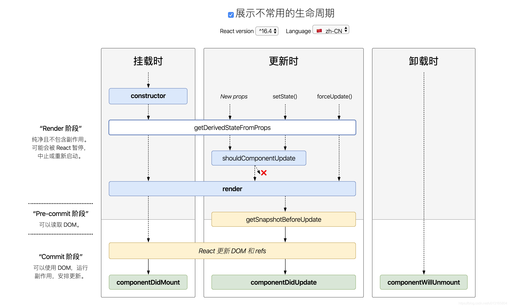

## webpack

### webpack核心概念

+ Entry：入口，告诉webpack要使用哪个模块作为构建项目的起点。默认为./src/index.js
+ output：出口，告诉webpack在哪里输出打包的代码以及命名。默认为./dist。
+ Loader：模块转换器，用于把模块原内容按照需求转换成新内容（比如sass转css，Ts转js）。
+ Plugin：插件可以监听这些时间的发生，在特定时机做对应的事情。


### webpack的工作原理

webpack可以理解是一个模块打包机，它做的事情是，分析你的项目结构，找到JavaScript模块以及其他的一些浏览器不能直接运行的拓展语言（Sass、Ts等），并将其转换和打包为合适的格式供浏览器使用。在3.0出现后，webpack还肩负起了优化项目的责任。


### webpack的打包原理

把一切都视为模块，不管是css、js、image还是html都可以互相引用，通过定义entry.js对所有的文件进行跟踪，将各个模块通过loader和plugins处理，然后打包在一起。

按需加载：打包过程中webpack通过code Splitting 功能将文件分为多个chunks，还可以将重复的部分单独取出来作为commonChunk，从而实现按需加载。把所有依赖打包成 一个bundle.js，通过代码分割成单元片段并按需加载。


### webpack的总体打包流程
Webpack首先会把配置参数和命令行的参数及默认参数合并，并初始化需要使用的插件和配置插件等执行环境所需要的参数；初始化完成后会调用Compiler的run来真正启动webpack编译构建过程，webpack的构建流程包括compile、make、build、seal、emit阶段，执行完这些阶段就完成了构建过程。这其实就是我们上面所讲到的。

+ **初始化参数： **从配置文件和 Shell 语句中读取与合并参数，得出最终的参数。

+ **开始编译： **根据我们的webpack配置注册好对应的插件调用 compile.run 进入编译阶段,在编译的第一阶段是 compilation，他会注册好不同类型的module对应的 factory，不然后面碰到了就不知道如何处理了。

+ **编译模块： **进入 make 阶段，会从 entry 开始进行两步操作：第一步是调用 loaders 对模块的原始代码进行编译，转换成标准的JS代码, 第二步是调用 acorn 对JS代码进行语法分析，然后收集其中的依赖关系。每个模块都会记录自己的依赖关系，从而形成一颗关系树。

+ **输出资源：**根据入口和模块之间的依赖关系，组装成一个个包含多个模块的 Chunk，再把每个 Chunk 转换成一个单独的文件加入到输出列表，这步是可以修改输出内容的最后机会。

+ **输出完成：**在确定好输出内容后，根据配置确定输出的路径和文件名，把文件内容写入到文件系统。


## react  
> 有vue基础，想学习react的开发人员，让你快速学习了解两个框架的不同之处，达到快速学习的目的。

### 生命周期
#### 挂载阶段
在组件实例被创建并插入DOM中时发生
+ **constructor()**:组件的构造函数，在创建组件实例时调用，用于初始化状态绑定方法。
+  **getDerivedStateFromProps(Props,state)**: 在组件挂载前调用，用于根据新的属性计算状态，放回一个对象来更新状态，或者返回`null`表示不更新状态。
+ **render()**: 渲染方法，返回React元素，描述组件UI的样子。
+ **componentDidMount()**: 在组件挂载后调用，通常用于执行初始化操作，数据获取等。

#### 更新阶段
在组件被重新渲染时发生，可以由组件的属性或状态的变化触发。
+ **getDerivedStateFromProps(props,state)**:同挂载阶段。
+ **shouldComponentUpdate(nextProps,nextState)**: 在组件更新前调用，返回`true`或`false`决定是否继续更新。用于性能优化。
+ **render()**:同挂载阶段。
+ **getSnapshotBeforeUpdate(prevProps,prevState)**: 在更新前调用，返回值将作为`componentDidUpdate`的第三个参数。
+ **componentDidUpdate(prevProps,prevState,snapsht)**: 在组件更新后调用，通常用于处理更新后的操作。

#### 卸载阶段
在组件从DOM中移除时发生。
+ **componentWillUnmount()**: 在组件卸载前调用，用于清理定时器、去掉网络等资源释放。

#### 特殊情况
+ **getDerivedStateFromError(error)**: 在组件渲染时发生错误时调用，用于捕获错误并更新状态，配合错误边界使用。
+ **componentDidCatch(err,info)**: 在组件渲染时发生错误后调用，用于记录错误信息或上报错误。

以上内容请看下图


### React 中组件间的通信有以下几种情况：
+ 父组件向子组件通信，可以通过 props 方式传递数据；也可以通过 ref 方式传递数据；
+ 子组件向父组件通信，通过回调函数方式传递数据；
+ 父组件向后代所有组件传递数据，如果组件层级过多，通过 props 的方式传递数据很繁琐，可以通过 Context.Provider 的方式；
+ 一个数据源实现跨组件通信，通过指定 contextType 的方式来实现；
+ 多个数据源实现跨组件通信，使用 Context.Consumer 方式实现；


## 微信小程序

### 页面跳转方式
wx.navigateTo(Object)：保留当前页面，跳转到应用内的某个页面，使用 wx.navigateBack 可以返回到原页（新页面入栈）  
wx.redirectTo(Object)：关闭当前页面，跳转到应用内的某个页面（当前页面出栈，新页面入栈）  
wx.switchTab(Object)：跳转到 tabBar 页面，同时关闭其他非 tabBar 页面（非Tab页面全部出栈，只留下新的 Tab 页面）  
wx.navigateBack(Object)：返回上一页面（页面不断出栈）  
wx.reLaunch(Object)：关闭所有页面，打开到应用内的某个页面（页面全部出栈，只留下新的页面）  

### 页面栈
小程序页面栈最多十层，页面栈的层数最多不会超过5层。 


### 小程序中是否存在跨域的问题

+ 小程序中不存在跨域的问题，因为不是浏览器
+ 小程序中需要在管理平台设置对应可访问的授权地址，可以设置多个，最多20个域名设置
+ 只能支持https协议
+ 最大并发数为10个，socket的并发限制为5个

### 优点和缺点是什么
优点：
1. 容易推广。在微信中，小程序拥有众多入口，且微信用户基数大，这些都有助于推广小程序；
2. 使用便捷。微信下拉即可打开小程序列表，点击即可使用小程序，不需要额外的安装操作等；
3. 体验良好。小程序不会像H5页面一样经常出现卡顿、延时、加载慢、权限不足等问题；
4. 成本更低，从开发成本到运营推广成本，小程序的花费仅为APP的十分之一。

缺点：
1. 单个包大小限制为2M，这导致无法开发大型的应用，采用分包最大是20M；
2. 需要像app一样审核上架，这点相对于H5的发布要麻烦一些；
3. 处处受微信限制。例如不能直接分享到朋友圈，涉及到积分，或者虚拟交易的时候，小程序也是不允许的。


### 生命周期
分为应用生命周期和页面生命周期

应用生命周期
onLaunch：小程序初始化完成时触发，全局只触发一次
onShow：小程序启动，或从后台进入前台显示时触发
onHide：小程序从前台进入后台时触发
onError：小程序发生脚本错误，或者 api 调用失败时触发
onPageNotFound：小程序要打开的页面不存在时触发
onUnhandledRejection：小程序有未处理的 Promise 拒绝事件时触发
onThemeChange： 监听系统主题变化

页面生命周期
onLoad：监听页面加载
onShow：监听页面显示
onReady：监听页面初次渲染完成
onHide：监听页面隐藏
onUnload：监听页面卸载
onPullDownRefresh：监听用户下拉动作
onReachBottom：页面上拉触底事件的处理函数
onShareAppMessage：用户点击右上角转发
onPageScroll：监听页面滚动
onResize：监听窗口尺寸变化
onTabItemTap：当前是 tab 页时，点击 tab 时触发


### bindtap和catchtap的区别是什么

bindtap是不会阻止冒泡事件的，catchtap是阻值冒泡的

### webview中的页面怎么跳转回小程序
+ webview中可以利用wx.miniProgram.navigateTo等方式跳转回小程序，跳转方法与小程序一致

+ 跳转回小程序如果通过switchTab等方式进行操作，默认情况是不会重新加载数据，可以尝试如下方式：
    + 利用onShow生命周期钩子函数，跳转之前设置全局变量，在onShow中进行条件判断是否进行业务逻辑操作（减少操作次数，优化性能）
    + 页面重新加载
    ```javascript
        wx.miniProgram.switchTab({
            url: '/pages/index/index'
            success: function(e) {
                var page = getCurrentPages().pop();
                if (page == undefined || page == null) return;
                page.onLoad();
            }
        })
        ```

### 如何获取用户手机号码
+ 目前该接口针对非个人开发者，且完成了认证的小程序开放（不包含海外主体）
+ 在微信小程序管理平台设置->基本信息的微信认证中进行确认，是否已经进行认证，认证过程需要提供公司相关信息，并且涉及到一定费用问题（微信公众平台申请微信认证，需支付300元/次认证费）
+  利用wx.login获取登录凭证code，通过code与开发者服务器交互获取加密后的openId，并将openId与session_key进行服务器数据库信息存储（后台利用nodejs、php、java等操作，具体参见：https://developers.weixin.qq.com/miniprogram/dev/api-backend/open-api/login/auth.code2Session.html）
+ 利用jsonwebtoken（或者其它加密方式，前后端人员需要确认）对openId进行加密传递回小程序端
+ 利用button进行open-type的类型设置，值为getPhoneNumber，并且需要进行bindgetphonenumber事件绑定
```js
<view class="container">
    <button open-type="getPhoneNumber" bindgetphonenumber="getPhoneNumber">getPhoneNumber</button>
</view>
```
+ 绑定回调getPhoneNumber中可以找到手机加密数据
+ 将加密的openId、encryptedData、iv等数据发送至服务器端
+ 服务器端通过解密openId，查询sesskon_key，获取encryptedData、iv以后（4个内容），需要对加密手机等信息数据进行解密处理
+ 解密介绍以及对应后台程序语言解密算法示例，https://developers.weixin.qq.com/miniprogram/dev/framework/open-ability/signature.html#%E5%8A%A0%E5%AF%86%E6%95%B0%E6%8D%AE%E8%A7%A3%E5%AF%86%E7%AE%97%E6%B3%95

### 分包的操作以及如何来计划分包
+ 分包主要包括：使用分包、独立分包、分包预下载
+ 分包：主包添加跳转路径，分包放内容，在app.json配置subpakeages声明项目分包结构。代码包总包大小为20M，单个主包/分包大小不能超过2M。
+ 按照功能划分的打包原则：可以按照功能的划分，拆分成几个分包，当需要用到某个功能时，才加载这个功能对应的分包；公共逻辑、组件放在主包内。
+ 首次启动时，先下载小程序主包，显示主包内的页面；如果进入了某个分包的页面，再下载这个对应分包，下载完毕后，显示分包的页面，
+ 总结：首先配置好打包路径，tabbar页面必须在主包内，各分包之间不能互相调用，能调用的都在主包内

### 一个邮箱可以注册几个小程序？个人、个体工商户和企业分别可以注册几个小程序？
+ 同一个邮箱只能申请注册1个小程序
+ 个人和个体工商户可以注册5个小程序
+ 企业资质可以注册50个小程序

### 小程序排名如何优化？
+ 小程序上线时间越早，排名越靠前
+ 描述中出现完全匹配出现关键词次数越多，排名靠前
+ 标题中关键词出现1次，且整体标题的字数越短，排名靠前
+ 微信小程序用户使用数量越多，排名靠前
+ 小程序的名称作为核心关键词语排名

## echarts


### EChart图表底色设置问题 ： 
EChart的DOM一般为DIV，直接设置EChart所在DOM的背景色是没有任何作用的，因为不管怎么设置，EChart都会将颜色设置成transparent（透明）；因此，要设置背景色，需要在外部再添加一个DIV，通过设置外部DIV的背景色达到修改EChart图表背景色的目的。


### 当x轴太拥挤,x轴数据不能全部展示怎么办?
1. 这时候就只需要在xAxis的axisLabel对象中添加属性 interval : 0 就可以显示全部数据 , interval 属性是用来调整x轴数据的间距的 , 数值越大间距越大 .

```js
xAxis: [
        axisLabel: {
            interval:0, 
        }
    ]
```

2. 当x轴数据太多,水平展示太过拥挤,可以选择垂直展示或者倾斜展示

```js
xAxis: [
        axisLabel: {
            rotate: 30,
        }
    ]
```


### 对echarts中的属性进行操作后,需要更新echarts图,怎么操作?
首先要确定,echarts 的 option 是否是操作后的最新数据,如果不是则需要对 option 进行检查,直到拿到最新数据再使用 this.$ref.mychart.setOption(this.option) 进行视图更新, 如果使用 this.$ref.mychart.setOption(this.option) 更新无效,则可以使用 this.$ref.mychart.setOption(this.option , true) 强制更新   

```js
 // 强制刷新页面,true
 this.$nextTick(() => {
     this.$refs.mychart.setOption(this.option, true)
  })
```

### echarts数据y轴刻度默认显示千分制,如果不需要怎么办?
在 ECharts 中，要取消 Y 轴的千分位格式化，可以通过设置 axisLabel 的 formatter 属性为一个简单的字符串模板或者一个函数，该函数直接返回传入的值。

以下是一个简单的例子，展示如何取消 Y 轴的千分位格式化：
```js
yAxis: {
        type: 'value',
        axisLabel: {
            // 使用函数作为 formatter，直接返回数值
            formatter: function(value) {
                return value;
            }
        }
    }
```