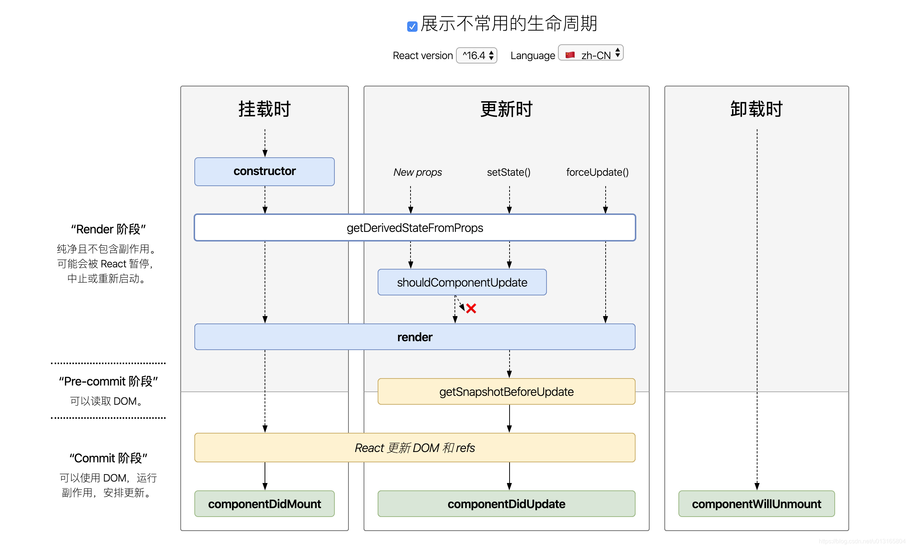

>>> 有vue基础，想学习react的开发人员，让你快速学习了解两个框架的不同之处，达到快速学习的目的。

## 生命周期
### 挂载阶段
在组件实例被创建并插入DOM中时发生
+ **constructor()**:组件的构造函数，在创建组件实例时调用，用于初始化状态绑定方法。
+  **getDerivedStateFromProps(Props,state)**: 在组件挂载前调用，用于根据新的属性计算状态，放回一个对象来更新状态，或者返回`null`表示不更新状态。
+ **render()**: 渲染方法，返回React元素，描述组件UI的样子。
+ **componentDidMount()**: 在组件挂载后调用，通常用于执行初始化操作，数据获取等。

### 更新阶段
在组件被重新渲染时发生，可以由组件的属性或状态的变化触发。
+ **getDerivedStateFromProps(props,state)**:同挂载阶段。
+ **shouldComponentUpdate(nextProps,nextState)**: 在组件更新前调用，返回`true`或`false`决定是否继续更新。用于性能优化。
+ **render()**:同挂载阶段。
+ **getSnapshotBeforeUpdate(prevProps,prevState)**: 在更新前调用，返回值将作为`componentDidUpdate`的第三个参数。
+ **componentDidUpdate(prevProps,prevState,snapsht)**: 在组件更新后调用，通常用于处理更新后的操作。

### 卸载阶段
在组件从DOM中移除时发生。
+ **componentWillUnmount()**: 在组件卸载前调用，用于清理定时器、去掉网络等资源释放。

### 特殊情况
+ **getDerivedStateFromError(error)**: 在组件渲染时发生错误时调用，用于捕获错误并更新状态，配合错误边界使用。
+ **componentDidCatch(err,info)**: 在组件渲染时发生错误后调用，用于记录错误信息或上报错误。

以上内容请看下图

## React 中组件间的通信有以下几种情况：
+ 父组件向子组件通信，可以通过 props 方式传递数据；也可以通过 ref 方式传递数据；
+ 子组件向父组件通信，通过回调函数方式传递数据；
+ 父组件向后代所有组件传递数据，如果组件层级过多，通过 props 的方式传递数据很繁琐，可以通过 Context.Provider 的方式；
+ 一个数据源实现跨组件通信，通过指定 contextType 的方式来实现；
+ 多个数据源实现跨组件通信，使用 Context.Consumer 方式实现；