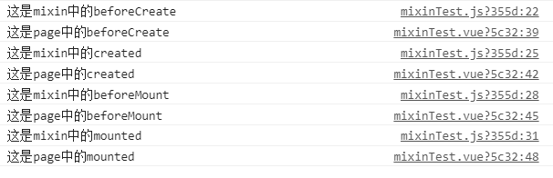

### MVC是什么

mvc是model-view-controller的缩写。

主要目的是对代码解耦，把混合在一起的代码拆分为3个部分。

让html中不存在任何逻辑代码，没有javascript代码痕迹。


+ model：数据模型层

   早期前端：弱化的model，不关注Model层，数据都是从服务器下来，直接使用即可。  
   现在前端：使用webStorage，框架中的vuex，Redux等管理数据。  
   在TypeScript语言中，新增了数据类型声明特征，才让Model在前端变得尤为重要。

+ View：视图层

   书写普通的html，不掺杂任何js代码。  
   例如：``<button id='tedu'>Tedy</button>``  
   注意：此按钮没有onclick的事件写法。

+ Controller：控制层

   控制HTML的具体行为，具体为script代码范围。列入id=‘tedu’的按钮事件写法；
   ```js
   var btn=docuent.getElementById("tedu");
   btn.onclick=functon(){alret('123')}
   ```

###  MVVM是什么

MVVM就是Model-View-ViewModel的简写。他本质上就是MVC的改进版。MVVM就是将其中的view的状态和行为抽象化，让我们将视图UI和业务逻辑分开。

以vue为例：

+ Model：数据模型层  
   script部分的data属性，专门管理数据。

+ View：视图层  
   即template中的代码，负责UI的构建。

+ ViewModel：视图模型层  
   new Vue({ })部分。自动管理数据和视图层。  
   重点是双向数据绑定功能，实现变化视图自动更新，视图变化，数据自动联动。

**解决了什么问题**

+ 开发者在代码中大量调用相同的DOM API，处理繁琐，操作冗余，使得代码难以维护。
+ 大量的DOM操作使页面渲染性能降低，加载速度变慢，影响用户体验。
+ 当Model频繁发生变化，开发者需要主动更新到View；当用户的操作导致Model发生变化，开发者同样需要将变化的数据同步到Model中，这样的工作不仅繁琐，而且很难维护复杂多变的数据状态。

> 其实，早期的jQuery的出现就是为了前端能更简洁的操作DOM而设计的，但它只解决了第一个问题，另外两个问题一直存在，MVVM的出现，完美的解决了以上三个问题。


###  Vue双向绑定原理

采用数据劫持 

结合发布者-订阅者模式的方式，

通过Object.defineProperty()来劫持各个属性的setter，getter，

在数据变化时发布消息给订阅者，

触发相应的监听回调。


具体步骤如下：

1. 首先，先要对observe的数据对象进行递归遍历，包括子属性对象的属性，都加上setter getter。这样的话，给这个对象的某个属性赋值，就会触发setter，那么就能监听到数据变化。（其实是通过Object.defineProperty（）实现监听数据变化的）

2. 然后，需要compile解析模板指令，将模板中的变量替换成数据，接着初始化渲染页面视图，并将每个指令对应的节点绑定更新函数，添加监听数据的订阅者，一旦数据有变动，订阅者收到通知，就会更新视图。

3. 接着，Watcher订阅者是Observer和Compile之间通信的桥梁，主要负责：

   ​	1）在自身实例化时，往属性订阅器（Dep）里面添加自己

   ​	2）自身必须有一个update()方法

   ​	3）待属性变动，dep.notice()通知时，就调用自身的updete()方法，并触发Compile中绑定的回调
   
4. 最后，viewmodel（vue实例对象）作为数据绑定的入口，整合Observer，Compile，Watcher三者，通过 Observer来监听自己的model数据变化，通过Compile来解析编译模板指令，最终利用Watcher搭起 Observer和Compile之间的通信桥梁，达到数据变化 (ViewModel) -> 视图更新(view)；视图变化 (view) -> 数据(ViewModel)变更的双向绑定效果。


###  Vuex是什么

Vuex是一个 **状态管理模式**。

它采用集中式存储管理，管理所有组件的状态，并以相应的规则保证状态以一种可预测的方式发生改变。

使用场景：

+ 组件的状态共享：登录状态
+ 组件的数据共享：购物车的数据，登录的token。

5个核心属性：

+ state：数据存放
+ getters：相当于计算属性（一个变量被多次调用，就可以存放在getters中）调用后就会缓存起来，值发生了改变才会被重新计算。``this.$store.getters.name(值)``
+ mutation：同步操作，修改数据，``this.$store.commit('方法',值)``
+ action：异步操作``this.$store.dispatch('方法',值)``
+ modules：模块化 modules：模块化


###  vue-router原理

https://blog.csdn.net/xiasohuai/article/details/81982821

vue-roter通过**hash、history、abstract**三种方式实现前端路由

更新视图但不重新请求页面是前端路由原理的核心之一

目前在浏览器环境中这一功能的实现主要有两种方式：

1. hash：利用URL中的hash，形式上会多个#

   #号的作用是加载URL中指定网页中的位置

   + hash虽然出现在url中，但不会被包括在http请求中，它是用来指导浏览器动作的，对服务器端完全无用，因为改变hash不会重新加载页面。

   + 每一次改变hash，都会在浏览器访问历史中增加一个记录。

     利用hash的以上特点，就可以来实现前端路由 "**更新视图不重新请求页面**“ 的功能。

2. history：html5中新增的方法，形式上比hash更好看

   history interoce是浏览器历史记录栈提供的接口，通过back()、forward()、go()等方法，我们可以读取浏览器历史记录栈的信息，进行各种跳转操作。

   从html5开始，history提供了2个新的方法：pushState()、replaceState()使得我们可以对浏览器历史记录栈进行修改

   这2个方法有个共同的特点：当调用他们修改浏览器历史栈后，虽然当前url改变了，但浏览器不会立即发送请求该url，这就是为单页应用前端路由，更新视图但不重新请求页面提供了基础

   **historty模式需要后端服务器进行 路由重写 处理，否则会报404错误**

+ hash：使用URL hash值来做路由，默认传参

  + 改变hash并不会引起页面重载
  + HTTP请求不包括#，所以使用hash不会影响到其他功能
  + 改变#会改变浏览器的访问历史
  + window.location.hash可以读取哈希值
  + JavaScript可以通过onhashchange监听到hash值的变化，这就意味着可以知道用户在浏览器手动改变了hash值

+ HTML5 history：依赖HTML5 History API 和服务器配置。

  ​	主要新增的两个api

  + pushState(状态对象，标题，URL)方法

    + 在浏览器历史记录栈中添加一个新的地址

  + replaceState(状态对象，标题，URL)方法

    + 替换当前的地址，不会去创建新的

      

+ abstract：支持所有JavaScript运行环境。如Node.js服务器


###  v-if 和 v-show 的区别

区别

+ v-if
  + 通过删除DOM元素实现元素的隐藏
  + 惰性：只有条件为真时，才会加载元素到DOM树
+ v-show
  + 通过设置元素的css样式：display:none 实现元素的隐藏，不操作DOM
  + 非惰性：不管条件真与假，都会加载元素到DOM

所以

+ v-if 的开销比 v-show 更大
+ v-show 有更高的初始渲染消耗

使用场景

+ 一个元素频繁进行隐藏和显示，使用v-show更合适

+ 一个元素不频繁进行 隐藏和显示操作，使用v-if更合适

   列如：需要网络请求成功后才显示的内容


###  Vue的生命周期有哪些？使用场景？

**加载时**

+ beforeCreate：准备创建
  + data和methods都未创建，此处不能使用。用于插件开发中执行一些初始化任务
+ created：创建完毕
  + data和methods创建完毕，各种数据可以使用，常用于异步数据获取
+ beforeMount：开始挂载
  + 未执行渲染，更新，dom未创建
+ mounted：挂载完毕
  + 初始化结束，dom已创建，可以获取访问数据和dom元素。

**更新**

+ beforeUpdate：更新前
  + 更新前，用于获取更新前的各种状态
+ updated：更新完毕
  + 更新后，所有状态已是最新版

**销毁**

+ beforeDestroy：销毁前
  + 销毁前，用于一些定时器或订阅的取消
+ destroyed：销毁完毕
  + data和methods此处已消失，无法使用

**激活**
+ activated：激活前
  + keep-alive 组件激活时调用
+ deactivated：激活后
  + keep-alive 组件停用时调用，可清除定时器（相当于beforeDestroy）

+ errorCaptured
  + 当捕获一个来自子孙组件的错误时被调用，此钩子会收到三个参数：错误对象、发生错误的组件实例以及一个包含错误来源信息的字符串，此钩子可以返回 false 以阻止该错误继续向上传播。


### 组件通信方式

1、 props / emit 父传子，子传父

​	   缺点：跨组件、同级传参麻烦

2、provide与inject

  数据向下传递。成对使用。

​		缺点：子组件不能向祖先组件传递数据。  
         不是响应式（但如果传入对象，是响应的）

```js
// A组件 父级
  <div>
    <h1>A 组件</h1>
    <ChildrenB />
  </div>
  provide() {
    return {
      theme: this // 方法一：提供祖先组件的实例
      name: ()=> this  // 响应式写法
    };
  }

  // F组件 子级或者孙级
  <div class="border2">
    <h3 :style="{ color: injections.theme.color }">F 组件</h3>
  </div>
  // 也可以使用对象的方式接收，可设置默认值
  inject: ['theme','name']
  // name传递的是函数，需要调用才行
```

3、$attrs / $listeners

 		能够实现子传祖

4、EventBus

​		类似vuex，实现全局通讯

```js
// 全局定义，将eventBus绑定到vue实例的原型上
Vue.prptptype.$EventBus=new Vue()

// 监听事件
this.$EventBus.$on('eventName',(param1,param2,...)=>{'函数'})

//触发事件
this.$EventBus.$emit('eventNmae', param1,param2,...)

// 移出监听事件
this.$eventBus.$off('eventName')
```

5、ref   $parent $children

​		缺点：1. 不能跨级访问

​				    2. 不能直接修改父组件的元素（可以通过给父组件传递事件修改）

```js
https://www.jianshu.com/p/e0d0125f8dd9
```


### vue权限管理

一、页面级的权限(用户是否有权限能看到这个页面)

  1. 后端返回路由信息，前端存储完整路由表：  
      前端拿到路由信息采取递归的方式动态生成页面菜单。自己本身的router.js文件定义好页面所有的路由。这种方式弊端很明显，并不能实现真正的权限控制，因为如果用户记住了某个理由，用户不点击菜单，直接在地址栏里输入地址，那么页面还是可以显示出来
  2. 后端返回路由权限名，前端存储完整路由权限表，并动态生成路由(真正的权限控制)  
      首先前端router.js文件存储的路由配置信息会分为两部分，分别是需要权限的和不需要权限的。
      页面一开始不能一个路由没有，所以会有一些不需要权限的页面，比如登录页，404页面等。所以一开始直接渲染
      这个不需要权限的路由表，等后台返回之后再把需要权限的路由加到当前路由里面形成一个全新的路由表就可以了
  3. 前端存储基础路由，后端返回路由，addRoutes添加  
      前端存储基础的路由，如login，404路由。登陆成功之后直接由后端返回异步路由表，然后前端直接通过addRoutes方法添加。减少了前端工作量，但是实际工作比较麻烦，前端每次要加权限都需要让后端帮助添加， 因为路由表是在后端维护的。

二、按钮级的权限(用户是否能看到或者能用页面中的某个按钮)  
  1. 后端返回权限，前端判断用户权限，显示当前按钮。  
  2. 自定义指令，获取用户权限，判断元素是否显示隐藏

  ### vue路由守卫

#### 完整的导航解析流程
1.导航被触发。  
2.在失活的组件里调用 beforeRouteLeave 守卫。   
3.调用全局的 beforeEach 守卫。  
4.在重用的组件里调用 beforeRouteUpdate 守卫 (2.2+)。  
5.在路由配置里调用 beforeEnter。  
6.解析异步路由组件。  
7.在被激活的组件里调用 beforeRouteEnter。   
8.调用全局的 beforeResolve 守卫 (2.5+)。  
9.导航被确认。   
10.调用全局的 afterEach 钩子。  
11.触发 DOM 更新。  
12.调用 beforeRouteEnter 守卫中传给 next 的回调函数，创建好的组件实例会作为回调函数的参数传入。

总结：

路由守卫一共有三种：全局路由守卫、组件内路由守卫、独享守卫。

+ 全局路由守卫 

  ```javascript
  //全局前置守卫                        
  router.beforeEach((to,from,next)=>{
      // 所有的路由都会走这个函数
      // 用于权限判断
  })
  
  //全局解析守卫
  router.beforeResolve((to,from,next)=>{
      // 和前置守卫一样，区别是等组件内守卫和异步组件执行完后，解析守卫才会被调用
  })
  
  //全局后置钩子
  router.afterEach((to.from)=>{
  	// 不接受next函数，也不会改变导航本身
  })
  ```

+ 路由独享守卫

  ```javascript
  const router = new VueRouter({
    routes: [
      {
        path: '/foo',
        component: Foo,
        beforeEnter: (to, from, next) => {
          // 直接在路由中配置，和beforeEach写法一样
        }
      }
    ]
  })
  ```

+ 组件内的守卫

  ```javascript
    beforeRouteEnter(to, from, next) {
      // 在渲染该组件的对应路由被 confirm 前调用
      // 不！能！获取组件实例 `this`
      // 因为当守卫执行前，组件实例还没被创建 
    },
    beforeRouteUpdate(to, from, next) {
      // 在当前路由改变，但是该组件被复用时调用
      // 举例来说，对于一个带有动态参数的路径 /foo/:id，在 /foo/1 和 /foo/2 之间跳转的时候，
      // 由于会渲染同样的 Foo 组件，因此组件实例会被复用。而这个钩子就会在这个情况下被调用。
      // 可以访问组件实例 `this`
    },
    beforeRouteLeave(to, from, next) {
      // 导航离开该组件的对应路由时调用
      // 可以访问组件实例 `this`
    }
  ```


###  v-if和v-for的优先级

当v-if与v-for一起使用时，v-for具有比v-if更高的优先级，这意味这v-if将分别重复运行于每个v-for循环中

解决方案：

1. 放在计算属性遍历。（官方建议，还能兼容vue3）
2. 在外层加一个template标签，将v-for放在template标签之中。

vue内部把v-if的代码封装成一个匿名函数，传递给了v-for，而v-for最后实现时，再来执行v-if。


### vue中的methods,watch和computed区别

https://blog.csdn.net/ligang2585116/article/details/94590314

**计算属性computed** 

> 理论上，computed所有实现可以使用methods完全替换

1. 支持缓存，只有依赖数据发生改变，才会重现计算
2. 不支持异步，当computed内有异步操作时无效，无法监听数据的变化
3. 当页面中有某些数据依赖其他数据进行变动的时候，可以使用计算属性。
6. 监听数据不用在data中声明。

**侦听属性watch**

1. 不支持缓存，数据变会直接触发相应的操作；
2. watch支持异步。
3. 监听的函数接受两个参数，第一个参数是最新的值，第二个参数是输入之前的值；
4. 当一个属性发生变化时，需要执行对应的操作，一对多；
5.  监听数据必须是data中声明过或者父组件传递过来的props中的数据，当数据变化时，触发其他操作，函数有两个参数


### 什么是虚拟dom，有什么好处

虚拟dom就是用来模拟DOM结构的一个js对象。·

**减少对真实DOM的操作**

​	   在vue，react技术出现之前，我们要改变页面展示的内容只能通过遍历查询dom树的方式找到需要修改的dom然后修改样式行为或者结构，来达到更新视图的目的。这种方式相当消耗计算资源，因为每次查询dom几乎都需要遍历整颗dom树，如果建立一个与dom树对应的虚拟dom对象（js对象），以对象嵌套的方式来表示dom树，那么每次dom树的更改就变成了js对象属性的更改，这样 查找js对象属性变化要比查询dom树的性能开销要小。

**vue的方式**

vue采用的是虚拟dom

通过重写setter，getter。

实现观察者监听data属性的变化。

生成新的虚拟dom

通过函数创建真实的dom

替换dom树上对应的旧dom。

**缺点**
无法进行极致优化：虽然虚拟DOM+合理的优化，足以应对绝大部分的性能需求，但在一些性能要求极高的应用中虚拟DOM无法进行针对性的极致优化。首次渲染大量DOM时，由于多了一层虚拟DOM的计算，会比innerHTML慢。


### 解决首屏加载慢

单页面应用首次加载的文件较多，导致首屏渲染速度很慢。

安装webpack-bundle-analyzer插件，通过这个插件，可以看出打包文件的大小

**1. 路由懒加载**

**2. 压缩代码并移除console**

**3. 使用cdn，引用第三方库，静态资源oss减小服务器压力**

**4. 开启gzip**

**5. 去掉编译文件的中的map文件**

​	这些文件主要是帮助我们线上调试代码，查看样式。所以为了避免部署包过大，通常不生成这些文件。

​	在config/index.js文件中将productionSourceMap的值设置为false。


### 插槽slot，有几种方法

主要分三种，默认插槽、具名插槽、作用域插槽

**默认插槽**

```html
// 父组件
<children>
    <p>我会显示</p>
</children>

// 子组件
<div>
    <solt>我是默认信息</solt>
</div>
```

**具名插槽**

```html
// 父组件
<base-layout>
  <template v-slot:header>
    <h1>Here might be a page title</h1>
  </template>

  <template v-slot:default>
    <p>A paragraph for the main content.</p>
    <p>And another one.</p>
  </template>

  <template v-slot:footer>
    <p>Here's some contact info</p>
  </template>
</base-layout>

// 子组件
<div class="container">
  <header>
    <slot name="header"></slot>
  </header>
  <main>
    <slot></slot>
  </main>
  <footer>
    <slot name="footer"></slot>
  </footer>
</div>
```

**作用域插槽**

在template中写的变量是无法访问到父组件的，需要通过v-slot传值的方式，也叫作用域插槽

```html
// 父组件
<current-user>
  <template v-slot:default="slotProps">
    {{ slotProps.user.firstName }}
  </template>
</current-user>

// 子组件
<span>
  <slot>{{ user.lastName }}</slot>
</span>
```


### vue-router 如何做历史返回提示

获取vue-router的上一个页面是否存在或者是否为自己需要返回的地址，可以使用vue-router的声明周期函数

+ 使用全局函数beforeEach，直接来获取form.path（即为对应的上一次地址的路由path内容）
+ 使用组件内共享函数beforeEnter，直接来获取form.path
+ 使用组件内函数，beforeRouteEnter，直接来获取form.path


### v-for为什么要加key

key是唯一标识，它作用主要是为了更高效的让diff算法更准确的找到需要被对比的两个结点  

如果不定义key的话，Vue只能认为比较的两个节点是同一个，导致了频繁更新元素，使得整个patch（diff算法）过程比较低效，影响性能。 

在实际的使用中在渲染一组列表时key必须设置，而且必须是唯一标识（所以不能用随机数做key），应该避免使用index作为key，因为会导致一些隐蔽的bug；Vue中在使用相同标签元素过渡切换时，也会使用key属性，其目的也是为了让Vue可以区分它们，否则Vue只会替换其内部属性而不会触发过渡效果。  

**index不能作为key值**


### keep-alive

1. keep-alive是vue内置的一个组件，可以使用包含的组件保留状态，避免重新渲染。
2. 一般结合路由和动态组件一起使用，用于缓存组件。
3. 对应两个钩子函数activated和deactivated，当组件被激活时，触发钩子函数activated，当组件被移除时，触发钩子函数deactivated。
4. 提供include和exclude属性，两者都支持字符串或正则表达式，include表示只有名称匹配的组件会被缓存，exclude表示任何名称匹配的组件都不会被缓存，其中exclude的优先级比include高。
5. 页面的created，mounted不会起作用，想要在进入页面时获取新的数据。需要使用activated和deactivated。
  activated：组件被激活时使用，返回页面需要重新渲染，就在此钩子下调用。
  deactivated：组件被停用时调用，用于清除定时器或其他


### $nextTick

> vue dom是异步执行的，一旦观察到数据变化，vue就会开启一个队列，然后把同一个事件循环当中观察到数据变化的watcher推送到这个队列。如果这个watcher被触发多次，只会被推送一次。这种缓冲行为可以有效的去掉重复数据造成的不必要的计算和dom操作。而在下一个事件循环时，vue会清空队列，并进行必要的dom更新。
>
> 当我改变dom数据的时候，dom不会立马更新，而是在异步队列中被清除，也就是下一个事件循环开始时执行更新时才会进行必要的dom更新。如果此时你想要根据更新的dom状态去做某些事情，就会出现问题。为了在数据变化之后等待vue完成更新dom，可以在数据变化之后立即使用vue.nextTick。这样回调函数在dom更新完之后就会调用。


作用：将回调延迟到下次DOM更新周期之后执行

下次DOM更新周期：其实是下次微任务执行时更新DOM，而nextTick时将回调添加到微任务中。

**原理**

1. 先定义一个callbacks（回调）存放所有的nextTick里的回调函数。

2. 然后判断一下当前的浏览器内核是否支持Promise，支持就用Promise来触发回调函数。

3. 如果不支持Promise，再判断是否支持MutationObserver（一个可以监听DOM结构变化的接口，观察文本节点发生变化时，触发执行所有回调函数）。

4. 如果不支持MutaionObserver,再判断是否支持setLmmediate。

5. 如果以上都不支持就只能用setTimeout来完成异步执行了。

   延迟调用优先级如下：Promise》MutaionObserver》setlmmdiate》setTimeout


**nextTick里的宏任务和微任务**

关于宏任务，vue先判断是否支持setlmmediate，就是使用setlmmediate；不是就只能用setTimout。

关于微任务，vue会先判断是否支持promise，是就使用Promise，然后判断是否支持MutaionObserver，是就使用MutaionObserver；否则把宏任务赋值给微任务，把宏任务当作微任务执行。


### 混入 mixin

当多个组件中有相同的方法和处理逻辑，就可以使用 混入mixin。

创建一个minxin.js里定义了混入对象，并通过export导出：在其他组件中导入，直接使用methods中的方法。

```javascript
//在其他组件混入以后，其他组件里就都拥有了, hello方法，并自动在created中执行
export var myMixin = {
    //组件中的其他属性 都可写在这里
    methods: {
        hello: function (msg='') {
            console.log('hello from mixin!' + msg);
        }
    },
    created: function () {
        this.hello();
        // 同名钩子函数将合并为一个数组，因此都将被调用。另外，混入对象的钩子将在组件自身钩子之前调用。
        console.log('混入对象-created');
    }
};
```

+ **对于同名的变量和方法，只执行page中的代码。**

+ **混入和page页面代码执行顺序（mixin先执行）**




### vue子组件调用父组件的方法
1. 直接在子组件中通过this.$parent.event来调用父组件的方法。
2. 在子组件里用$emit()向父组件触发一个事件，父组件监听这个事件就行了。
3. 父组件把方法传入子组件中，在子组件里直接调用这个方法。

### vue非响应式情况

响应式：数据a发生变化，会使得依赖数据a的数据和界面都会发生变化  
非响应式：数据a发生变化，而依赖该数据的地方没有变化  

  **非响应式的几种情况：**  

1. 使用了非变异方法（没有修改原数据，而是返回了新数据）  
      arr.map(), arr.filter(), arr.slice(), arr.concat  
2. 修改了数组长度
3. 修改了数组索引上的值
      arr[0]
4. 给对象添加不存在的属性

  **解决办法**
1. Vue.set(数组|对象, index, value)
2. vm|this.$set(对象, key, value)
3. this.$forceUpdate() 强制刷新
4. this|vm.$mount('#app') 再次获取元素，将元素的的html内容替换掉


### Vue中动态添加多个class

```jsp
  <p :class="`${condition1 ? 'font' : ''}${condition1 ? ' size' : ''}`">
  <p :calas="[aa,bb]"></p>
  <p :calas="{aa,bb}"></p>
  <p :calas="classS1()"></p>
```


### Watch监听

watch：一个数据影响多个数据。

computed：一个数据受多个数据影响。缓存值，不会主动重新计算，只有存在依赖数据，依赖数据发发生改变才会重新计算。

**如果在handler函数中使用了箭头函数，改变了this指向，就无法获取到Vue实列，则为undefined。所以不要在这使用箭头函数，如果用，`let that=this`。**

**对于父子组件传参，异步获数据有时会存在获取不到值的情况。这是watch就派上用场，适当的时候配合immediate或者deep属性配合使用**

1. 常用

   ```javascript
   data:{
       name:'王'
   },
   watch:{
   	name:(newVal,oldVal){
           //newVal:表示新的值，oldVal：旧的值，位置不能改变
           conole.log(newVal,oldVal)
       }
   }
   ```

2. immediate、deep、handler属性

   immediate：当值第一次绑定的时候，不会执行监听函数，只有值发生改变才会执行。如果我们需要在最初绑定值的时候也执行函数，就需要用到immediate。

   deep：对于对象或者对象中的属性，可以使用deep。

   handler：使用immediate和deep时才会用。

   ```javascript
   data:{
       obj:{
          	a:'' 
       }
   },
   watch:{
   	obj:{
           hander(newVal,oldVal){
               console.log('newVal-a',obj.a)
               console.log('oldVal-a',obj.a)
           },
           deep:true,//深度监听
           immediate:true//首次加载执行
       }
   }
   ```

3. 监听长度，或者对象属性

   ```javascript
   data:{
       obj:{
          	a:'' 
       },
       arr=[1,2,3,4,5]
   },
   watch:{
   	'obj.a':{//监听对象属性
    'arr.length':{//监听数组长度，最好配合计算属性使用
    '$route':{//监听route变化。
        hander(newVal,oldVal){
            cons.log('newVal-a',obj.a)
            cons.log('oldVal-a',obj.a)
        }
      }
   }
   ```

4. 使用$watch

   ```javascript
   data:{
       obj:{
           a:'1'
       }
   }
   creatd(){
       this.$watch('name',(new,old)=>{
                console.log('new')
   	})
   }
   ```

5. Watch监听多个变量
  watch 本身不能监听多个变量。但是，我们可以通过返回具有计算属性的对象。通过计算属性的特性，去监听计算属性返回的值。 从而实现“监听多个变量”。
  ```js
    export default {
        data() {
            return {
                msg1:  apple ,
                msg2:  banana
            }
        },
        compouted: {
            msgObj() {
                const { msg1, msg2 } = this
                return {
                    msg1,
                    msg2
                }
            }
        },
        watch: {
            msgObj: {
                handler(newVal, oldVal) {
                    if (newVal.msg1 != oldVal.msg1) {
                        console.log( msg1 is change )
                    }
                    if (newVal.msg2 != oldVal.msg2) {
                        console.log( msg2 is change )
                    }
                },
                deep: true
            }
        }
    }
  ```

6. 一个监听器触发多个方法
  当特定开发需求，需要触发监听器执行多个方法时，可以使用数组，您可以设置多个形式，包括字符串、函数、对象。
  ```js
    export default {
        data: {
            name:  Joe
        },
        watch: {
            name: [
              // 调用定义的函数
                sayName1 ,
                // 
                (newVal, oldVal) => {
                    ...
                },
                {
                    handler:  sayName3 ,
                    immaediate: true
                }
            ]
        },
        methods: {
            sayName1() {
                console.log( sayName1==> , this.name)
            },
            sayName3() {
                console.log( sayName3==> , this.name)
            }
        }
    }
  ```


### vue内部指令

v-bind：响应并更新DOM特性

v-on：用于监听DOM事件

v-model：数据双向绑定，用于表单输入等

v-show：条件渲染指令，为DOM设置css的style属性

v-if：条件渲染指令 ，动态在DOM内添加或删除DOM元素

v-else：条件渲染指令，必须跟v-if成对使用

v-for：循环指令

v-else-if：判断多层条件，必须跟v-if成对使用

v-text：更新元素的txtContent

v-html：更新元素的innerHTML

v-pre：不需要表达式，跳过这个元素以及子元素的编译过程，以此来加快整个项目。

v-cloak：不需要表达式，这个指令保持在元素上直到关联实例结束编译

v-once：不需要表达式，只渲染元素或组件一次，随后的渲染，组件/元素以及下面的子元素都当成静态页面不在渲染


### v-on监听多个方法

```html
<input type="text" v-on={input:onInput,focus:onFocus,blur:onBlur}>
```


### vue中事件绑定加括号和不加括号的区别

```java
// 不带括号，不写实参。默认传event(事件对象)
@click="fun"

//只要加括号，无论是否传参，都属于传实参给函数，event(事件对象)就接受不到。
@click="fun(value)"

//如果需要传实参，又需要event(事件对象)，就需要手动传入event(事件对象)
@click=fun($event,value)
```


### vue2和vue3的区别

1. 默认进行懒观察

​		在2.0版本，不管数据多大，都会在一开始为其创建观察者。当数据很大的时候，这可能会在页面载入时造成明显的性能压力。3.0版本。只会对用于渲染的数据创建观察者，而3.0的观察者更高效。

2. 更精准的变更通知

   举例来说：2.0版本中，是一个vue.set来给对象新增一个属性时，这个对象的所有watcher都会重新运行；3.0版本中，只有依赖那个属性的watcher才会重新运行。

3. 新加了TypeScript以及PWA的支持

4. 部分命令发生改变

   ​	下载安装 npm install -g vue@cli
   　删除了vue list
   　创建项目 vue create
   　启动项目 npm run serve

5. 默认目录结构发生了变化

   移除了配置文件目录，config 和 build 文件夹
     　移除了 static 文件夹，新增 public 文件夹，并且 index.html 移动到 public 中
     　在 src 文件夹中新增了 views 文件夹，用于分类 视图组件 和 公共组件

6. 使用上的变化


### vue修饰符

**事件修饰符**

```html
<!-- 阻止单击事件继续传播 -->
<a v-on:click.stop="doThis"></a>
<!-- 提交事件不在重载页面 -->
<form v-on:submit.prevent:"onSubmit"></form>
<!-- 修饰符可以串联 -->
<a v-on:click.stop.prevent="doThat"></a>
<!-- 只有修饰符 -->
<form v-on:submit.prevent></form>
<!-- 添加事件监听器时使用事件捕获模式 -->
<!-- 即内部元素触发的事件先在此处理，然后才交由内部元素进行处理 -->
<div v-on:click.captrue="dothis">...</div>
<!-- 只当在event.target是当前元素自身触发处理函数 -->
<!-- 即事件不是从内部元素触发的 -->
<div v-on:click.self="doThat">...</div>
<!-- 点击事件将只会触发一次 -->
<a v-on:click.once="doThis"></a>
<!-- 滚动事件的默认行为(滚动行为会被立即触发) -->
<div v-on:scroll.passive="onScroll">...</div>

//使用修饰符，顺序很重要；相应的代码会以同样的顺序产生。因此，用v-on:click.prevent.self会阻止所有的点击，而v-on:click.sefl.preven只会阻止对元素自身的点击
```

**按键修饰符**

```javascript
<!-- 只有在‘key’是‘Enter’时调用‘vm.submit()’ -->
<input v-on.keyup.enter="submit">
```

**鼠标按键修饰符**
+ .left
+ .right
+ .middle

**v-model修饰符**

```html
<!-- 在“change”时而非“input”时更新 -->
<input v-model.lazy="msg">

<!-- 将用户输入的内容转为数值类型 -->
<input v-model.number="age" type="number">

<!-- 过滤用户输入的前后空白字符 -->
<input v-model.trim="msg">
```


###  router和route的区别

1. $router时vueRouter的一个对象，通过router的实列对象，这个对象是一个全局的对象，他包含了所有的路由，包含了许多关键的对象和属性。

   $router.push({path:'home'})，本质是向history栈中添加一个路由，在我们看来是切换路由，但本质是在添加一个history记录。

   $router.replace({path:'home'})，替换路由，没有历史记录

2. $route是一个跳转的路由对象，每个路由都会有一个$route对象，是一个局部的对象，可以获取对应的name，path，params，query，router，matchd等。


### vue-router路由传参的几种方式

1. get方法
  ```js
      <router-link :to="{path:'/test',query: { userId: 123,userName:'xia' }}">跳转</router-link>
      或
      <router-link :to="{name:'test',query: { userId: 123,userName:'xia' }}">跳转</router-link>
      //接收值（页面刷新的时候不会消失）
      this.$route.query.userId  // 123
      this.$route.query.userName  // xia
      // url上显示参数：http://localhost:8080/test?userId=123&userName=xia
  ```
2. post方法
  ```js
    <!-- 必须用 name:'test' -->
    <router-link :to="{name:'test',params: { userId: 123,userName:'xia' }}">跳转</router-link>

    <!-- 用 path:'/test' 无效 -->
    <!-- <router-link :to="{path:'/test',params: { userId: 123,userName:'xia' }}">跳转</router-link> -->
    // 接收值（页面刷新的时候就会消失）
    this.$route.params.userId  // 123
    this.$route.params.userName  // xia
    // url上不显示参数：http://localhost:8080/test
  ```
3. 路由方法
  ```js
      // router.js
    {
        path: '/test/:userId/:userName?', //?问号的意思是该参数不是必传项
        name: 'test',
        component: 'test.vue',
        props: true,
    },
    // App.vue
    <router-link to="/test/123/xia">跳转</router-link>
    // 接收值（页面刷新的时候不会消失）
    this.$route.params.userId  // 123
    this.$route.params.userName  // xia
    // url上显示参数：http://localhost:8080/test/123/xia
  ```


### 单项数据流的理解

vue中子组件可以使用父组件传递过来的数据，但是绝对不能修改传递过来的数据。

强行修改会导致你的应用数据流向难以理解。


### vue两行代码实现表单重置清空
  `this.$options.data()` 可以获取data中定义的初始数据
```js
  data() {
        return {
            formData: {
                username: '',
                password: ''
            } 
        }
    }, 
    //重置表单
      recover(){
         this.formData = {
                username: 'Green',
                password: 'admin123'
          }
          this.formData=this.$options.data().formData;
      }
    } 


```
### vue如何监听数组的变化

1. 使用watch 深度监听（性能消耗大，不推荐）

2. 重写数组函数，7种方法。

   ​	在将数组处理成响应式数据后，如果使用数组原始方法改变数组时，数组值会发生变化，但是并不会触发数组的setter来通知所有依赖该数组的地方进行更新，为此，vue通过重写数组的某些方法来监听数组变化，重写后的方法会手动触发通知该数组的所有依赖进行更新。

3. 利用计算属性+ watch

4. 直接监听对象中的属性

5. vue.set()或者this.$set()

   ```javascript
   vue.set(target,key,value)
   //vue.set(修改的值，修改的位置，修改后的参数)
   
   //页面中存在的属性，是可以直接通过赋值的方式更改，因为内部通过Object.defineProperty实现了数据双向绑定，但是对于后面新增的属性，是没有办法渲染的，那么就必须使用Vue.set()
   ```

### 获取vue data中的初始值
获取到data中的初始值，可以直接点出来单个的值：`this.data.options()`
获取当data组件当前的所有值： `this.$data`


### 解决父子组件执行顺序的问题
父beforeCreate->父created->父beforeMount->  
子beforeCreate->子created->子beforeMount->子mounted->  
父mounted

1. 
  ```javascript
  // 父组件
  mounted(){
      window.parentMounted = this._isMounted	// _isMounted是当前实例mouned()是否执行 此时为true
  }
  // 子组件
  mounted(){
      let time=setInterval(()=>{
      if(window.parentMounted){
            clearInterval(time)
              // 此时父组件的mounted已经执行完毕
              //...
          }
      },500)
  }
  ```

2. 通常我们使用 $emit 监听组件生命周期，父组件接收事件进行通知。
  ```js
  // 子组件
  export default {
    mounted() {
        this.$emit( listenMounted )
    }
  }
  // 父组件
  <template>
      <div>
          <List @listenMounted="listenMounted" />
      </div>
  </template>
  ```

3. 使用@hook 来监听组件的生命周期，而不需要在组件内部做任何改动。同样，创建、更新等也可以使用这个方法。

```vue
  <template>
    <div>
        <List @hook:mounted="listenMounted" />
    </div>
</template>
```

### vue组件中为什么data要写成对象的形式，而实例中不需要
  组件需要复用，实例不需要    
  https://blog.csdn.net/F_fengzilin/article/details/116710610

### computed中传递参数
```vue
  <div>add(10)</div>

  computed:{
    add(){
      conosle.log(num)
      // 直接使用箭头函数，值就是传递过来的值
      return v=>{
        return v+num
      }
    }
  }
```


