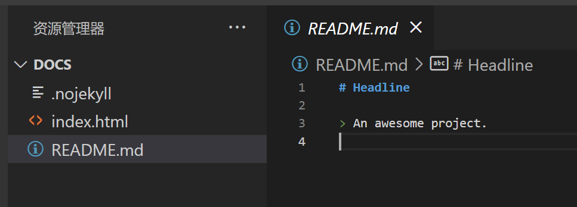
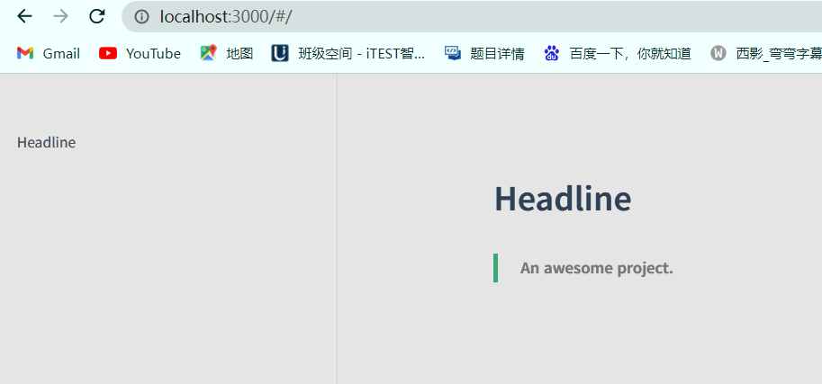

# 一、初始化项目

## 1.1、全局安装 ***docsify-cli*** 工具

```
npm i docsify-cli -g
```

## 1.2、初始化文档结构

先创建一个本地文件夹 ***docs***，然后执行命令

```
docsify init ./docs
```

会生成如下目录

```
-| docs
	 -| .nojekyll  用于阻止Github Pages 会忽略掉下滑线开头的文件
	 -| index.html 入口文件
	 -| README.md  作为主页内容渲染
```

## 1.3、本地实时预览

```
docsify serve docs
```

默认访问 ***http://localhost:3000***

<<<<<<< HEAD
<<<<<<< HEAD
=======
>>>>>>> 47763ffc41578d784b529cf7f4e3b45084d90e10
* README.md文件

  

* 预览效果：
<<<<<<< HEAD
=======
### 1. README.md文件

  

### 2. 预览效果：
>>>>>>> 2f95a7c (completed)
=======
>>>>>>> 47763ffc41578d784b529cf7f4e3b45084d90e10

  