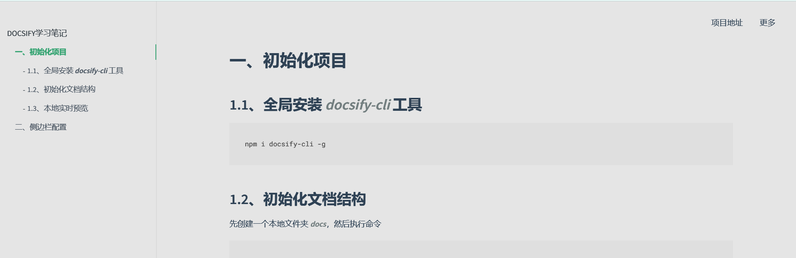

# 二、定制导航栏及侧边栏

<<<<<<< HEAD
<<<<<<< HEAD
## 2.1、 ***script*** 配置
=======
## 2.1、 ***script***配置
>>>>>>> 2f95a7c (completed)
=======
## 2.1、 ***script*** 配置
>>>>>>> 47763ffc41578d784b529cf7f4e3b45084d90e10

```
  <script>
    window.$docsify = {
      name: '',
      repo: '',
      loadNavbar: true,
      loadSidebar: true,
      maxLevel: 2,
      subMaxLevel: 4,
      mergeNvabar: true
    }
  </script>
```

<<<<<<< HEAD
<<<<<<< HEAD
* 添加 ***_sidebar.md*** 文件来配置侧边栏
=======
### 1. 添加 ***_sidebar.md*** 文件来配置侧边栏
>>>>>>> 2f95a7c (completed)
=======
* 添加 ***_sidebar.md*** 文件来配置侧边栏
>>>>>>> 47763ffc41578d784b529cf7f4e3b45084d90e10

  ```
  * DOCSIFY学习笔记
    * [一、初始化项目](docsifyUsage/docsifyUsageChapter1.md)
<<<<<<< HEAD
<<<<<<< HEAD
=======
>>>>>>> 47763ffc41578d784b529cf7f4e3b45084d90e10
    * [二、侧边栏配置](docsifyUsage//docsifyUsageChapter2.md)
  ```

* 添加 ***_navbar.md*** 文件来配置顶部导航栏

  ```
  * 项目地址
    * [GitHub地址]()
    * [Gitee地址]()
  * 更多
    * [博客主页](blog.renorchid.xyz)
  ```

* 查看效果
<<<<<<< HEAD
=======
    * [二、侧边栏配置](docsifyUsage/docsifyUsageChapter2.md)
  ```

### 2. 添加 ***_navbar.md***文件来配置顶部导航栏

  ```
  * 项目地址
    * [GitHub地址](https://github.com/arenxiaolanz/docsify_study)
    * [Gitee地址](https://gitee.com/ren-nino/docsify_study)
  * 更多
    * [博客主页](http://blog.renorchid.xyz/)
  ```

### 3. 查看效果
>>>>>>> 2f95a7c (completed)
=======
>>>>>>> 47763ffc41578d784b529cf7f4e3b45084d90e10

  