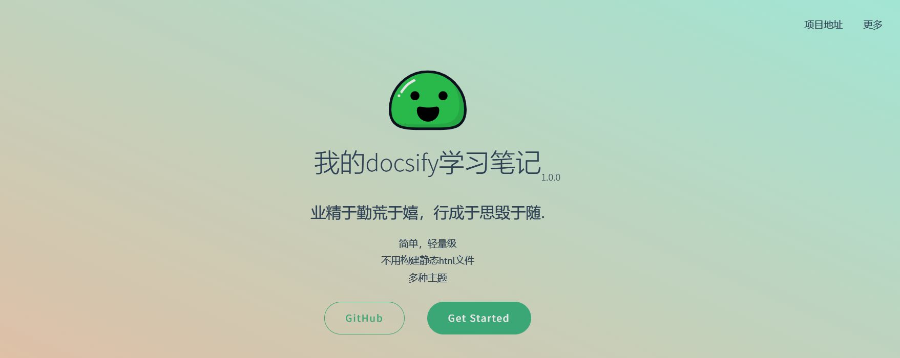

# 三、定制封面页

### 1. 在入口文件 ***index.html*** 中添加封面页的配置

```
<script>
  window.$docsify = {
    coverpage: true
  }
</script>
```

### 2. 添加  ***_coverpage.md*** 文件配置封面页

```
<!-- _coverpage.md -->


# 我的docsify学习笔记 <small>1.0.0</small>

> 业精于勤荒于嬉，行成于思毁于随.

- 简单，轻量级
- 不用构建静态htnl文件
- 多种主题

[GitHub](https://github.com/docsifyjs/docsify/)
[Get Started](#docsifyUsage/docsifyUsageChapter1)
```

### 3. 查看封面效果

  