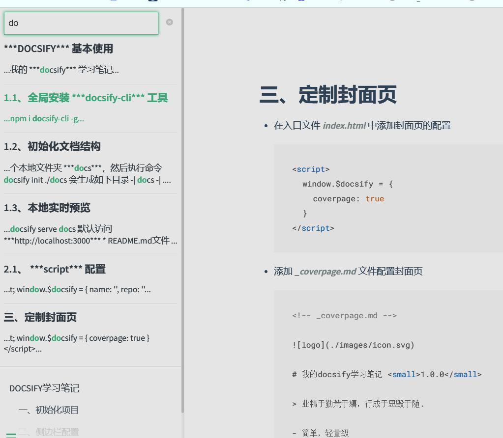

# 四、添加全文搜索

## 1. 在入口文件中添加全文搜索的配置

  ```
    <script>
      window.$docsify = {
        search: {
          maxAge: 86400000, // 过期时间，单位毫秒，默认一天
          placeholder: 'Type to search',
          noData: 'No Results!',
          // 搜索标题的最大层级, 1 - 6
          depth: 4,
          hideOtherSidebarContent: false, // 是否隐藏其他侧边栏内容
        }
      }
    </script>
      <script src="//cdn.jsdelivr.net/npm/docsify/lib/plugins/search.min.js"></script>
  ```

## 2. 查看搜索效果
<<<<<<< HEAD
<<<<<<< HEAD
=======

>>>>>>> 2f95a7c (completed)
=======
>>>>>>> 47763ffc41578d784b529cf7f4e3b45084d90e10
  