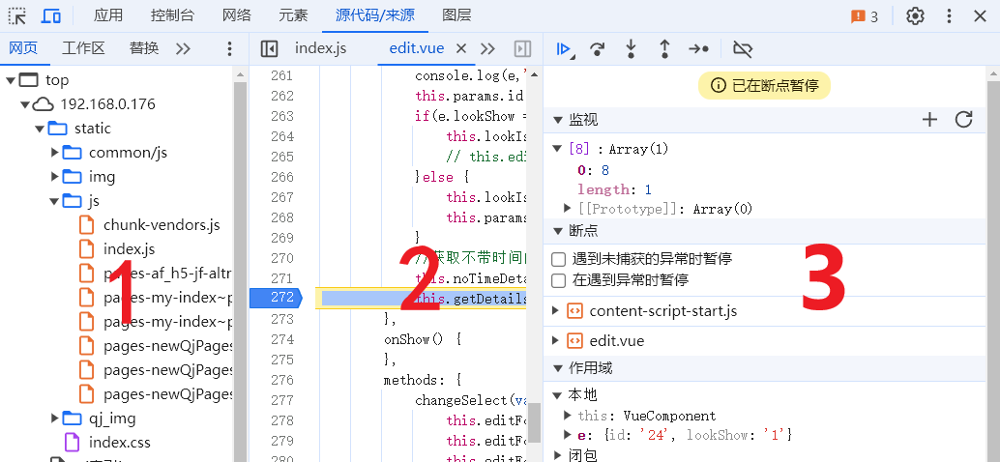
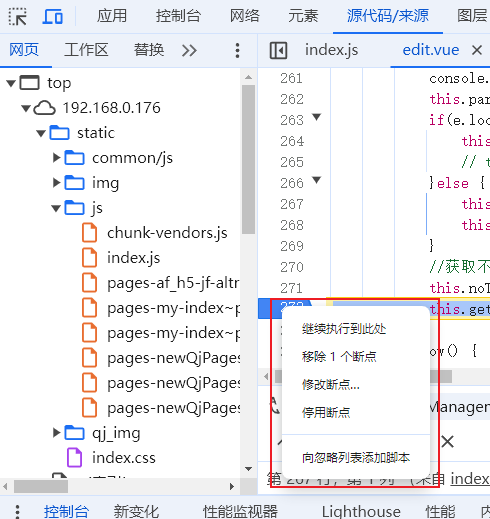
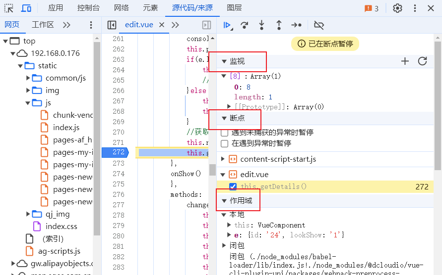

## Chrome控制台

### 断点调试

在“原代码/来源（Sources）”面板中。  
可以使用 `Ctrl+o` 来搜索你要找的文件名。  

面板包含三个部分：  

1. 文件导航（File Navigator） 区域列出了 HTML、JavaScript、CSS 和包括图片在内的其他依附于此页面的文件。Chrome 扩展程序也会显示在这。
2. 代码编辑（Code Editor） 区域展示源码。
3. JavaScript 调试（JavaScript Debugging） 区域是用于调试的，我们很快就会来探索它。

直接点击行号，可以进行断点。右键行号，也可以移除或者添加条件断点。
我们也可以在开发代码中添加 `debugger` 命令来暂停代码。（这样的命令只有在打开控制台时才有效）

1. 监视： 显示任意表达式的当前值。
    可以点击右侧+号输入一个表达式。调试器将显示它的值，并在执行过程中自动重新计算该表达式。
2. 断点：显示嵌套的调用链。
    此时，调试器正在调用`getDetails()`。（如果这里没有函数，会显示 “anonymous”）。  
    如果你点击了一个堆栈项，调试器将跳到对应的代码处，并且还可以查看其所有变量。
3. 作用域：显示当前的变量。

  **—— “恢复（Resume）”：继续执行，快捷键 F8。**  
 继续执行。如果没有其他的断点，那么程序就会继续执行，并且调试器不会再控制程序。

  **—— “下一步（Step）”：运行下一条（即当前行）指令，快捷键 F9。**

  **—— “跨步（Step over）”：运行下一条（即当前行）指令，但 不会进入到一个函数中，快捷键 F10。**

  **—— “步入（Step into）”，快捷键 F11。**

  **—— “步出（Step out）”：继续执行到当前函数的末尾，快捷键 Shift+F11。**

  **—— 启用/禁用所有的断点**
