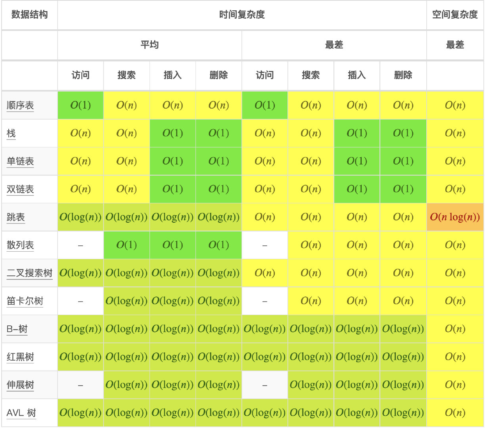
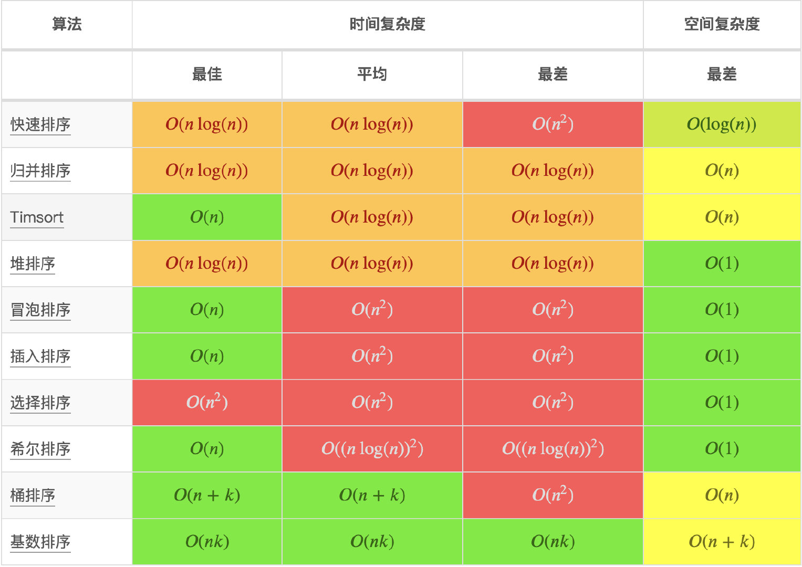

## 时间复杂度
时间维度：是指执行当前算法所消耗的时间，我们通常用【时间复杂度】来描述。


### 1、 时间复杂度的几条基本计算规则

1. 基本操作，即只有常数项，认为其时间复杂度为O(1)
2. 顺序结构，时间复杂度按**加法**计算
3. 循环结构，时间复杂度按**乘法**计算
4. 分支结构，时间复杂度取**最大值**
5. 判断一个算法的效率时，往往只需要关注操作数量的最高次项，其他次要项和常数项可以忽略
6. 在没有特殊说明时，我们所分析的算法的时间复杂度都是指**最坏时间复杂度**


### 2、 常见的时间复杂度

| 执行次数函数举例 | 阶       | 非正式术语 |
| ---------------- | -------- | ---------- |
| 12               | O(1)     | 常数阶     |
| 2n+3             | O(n)     | 线性阶     |
| 3n2+2n+1         | O(n2)    | 平方阶     |
| 5log2n+20        | O(logn)  | 对数阶     |
| 2n+3nlog2n+19    | O(nlogn) | nlogn阶    |
| 6n3+2n2+3n+4     | O(n3)    | 立方阶     |
| 2n               | O(2n)    | 指数阶     |

所消耗的时间从小到大

**O(1) < O(logn) < O(n) < O(nlogn) < O(n2) < O(n3) < O(2n) < O(n!) < O(nn)**


#### O(1) 常数阶

表示该算法的执行时间（或执行时占用的空间）总是为一个常量，无论输入的数据集时大是小，只要是没有循环等复杂结构，那这个代码的时间复杂度都是O(1).

```js
let i=1;
let j=2;
let i+j
```

上述代码在执行的时候，它消耗的时候随着莫格变量的增长而增长，那么无论这类代码有多长，即使有几万行，都可以用O(1)来表示它的时间复杂度


### O(logn)  对数阶

```js
let i=1;
while(i<n){
    i=i*2;
}
```

上面的代码，在while循环里面，每次都将i乘以2，乘完之后，i距离n就越近，直到i小于n退出。我们试着求解一下，假设循环次数为x，也就是2的x次方等于n，则由2^x=n得出x=log2n。因此这个代码的时间复杂度为O(logn)


#### O(n)  线性阶

表示一个算法的性能会随着输入数据而线性变化。

```js
for(let i=0;i<n;i++){
    console.log(i)
}
```

这段代码，for循环里面的代码会执行n遍，因此消耗的时间是随着n的变化而变化的，因此这类代码可以用O(n)来表示它的时间复杂度。


### O(nlogn)  线性对数阶

线性对数阶，就是将时间复杂度为对数阶O(logn)的代码循环n遍的话，那么它的时间复杂度就是n*O(logn)，也就是O(nlogn)。

```js
for(let m=1;m<n;m++){
    i=1;
    while(i<m){
        i=
    }
}
```

### O(n^2)   平方阶

O(n^2)表示一个算法的性能将会随着输入数据的增长而呈现出二次增长。最常见的就是对输入数据进行嵌套循环。如果嵌套层级不断深入的话，算法的性能将会变为立方阶O(n^3), O(n^4),O(n^k)依次类推

```js
for(let i=1;i<n;i++){
    for(let j=1;j<n;j++){
        console.log(j,i)
    }
}
```


### O(2^n)  指数阶

表示一个算法的性能会随着输入数据的每次增加而增大两倍，典型的方法就是斐波那契数列的递归计算实现

```js
add(n){
    if(n<=1) return n;
    return add(n-2) + add(n-1)
}
```


## 空间复杂度

 空间维度：是执行当前算法所需要占用多少内存空间，我们通常用【空间复杂度】来描述。


### 1、空间复杂度


#### O(1)

如果算法执行所需要的临时空间不随着某个变量n的大小而变化，即此算法空间复杂度为一个常量，可表示为O(1)

```js
let j=1;
let j=2;
++i;
j++;
let m=j+i;
```

代码常用的i，j，m所分配的空间都不随着处理数据量变化，因此它的空间复杂度S(n)=O(1)


#### O(n)

```js
let m=[]
let m.length=n
for(let i=;i<=n;++i){
  	j=i;
    j++;
}
```

这段代码中，第一行创建了一个数组，第二行给这个数组的长度设置为n，后面虽然有循环，但是没有在分配新的空间，因此，这段代码的空间复杂度主要看第一行即可，即S(n)=O(n)


### 2、 复杂度速查表


大O复杂度曲线


抽象数据结构的操作复杂度



数组排序



图操作


堆操作

