<!-- 不用管css -->
<style>
    pre{
        width: min-content;
        display: inline-block;
        padding-right: 2rem;
    }
    pre+p{
        display: inline-block;
        margin-left: 2rem !important;
        vertical-align: text-bottom;
    }
</style>
https://blog.csdn.net/qq_15855921/article/details/126991577


Bat脚本是一种在Windows操作系统中执行的脚本语言，主要用于自动化执行多个命令或操作。它以.bat为文件扩展名，包含了一系列按顺序执行的命令和指令，用于简化重复性任务、系统管理、软件安装与配置、数据处理和自动化测试等。Bat脚本简单易学，功能强大，兼容性好，是Windows用户常用的自动化工具。

### 使用echo输出
打印内容
```bat
echo hello world
pause
```
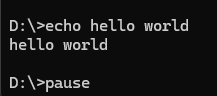

### 使用变量拼接
```bat
set param1=hello
set param2=world
echo %param1%%param2%ok
pause
```
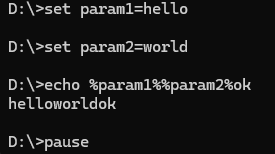

### 只想打印结果，不想回显 @echo off
```bat
@echo off
set param1=hello    
set param2=world    
echo %param1%%param2%ok 
pause   
```
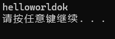

### 将dos界面暂停关闭 pause

### 设置dos的标题 title
```bat
@echo off
title this is a test
set param1=hello
set param2=world
echo %param1% %param2%
pause 
```
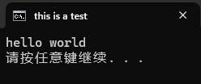

### 注释 rem
```bat
@echo off
title this is a test
set param1=hello
set param2=world
rem echo 这里不执行，下面这句是echo拼接语句
echo %param1%%param2%
pause 
```
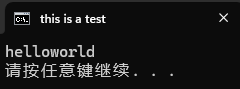

### 打印当前路径 %cd% 或者 %~dp0
```bat
@echo off
echo %cd%
echo %~dp0
pause 
```
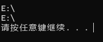

### 进入执行文件夹 cd 
```bat
@echo off
echo %cd%
cd TIM
echo %cd%
cd ..
echo %cd%
pause
```
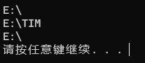

### 清空屏幕 cls

### 解决中文乱码
windows的cmd默认编码格式为ANSI。简体中文版的windows，对应微软codepage为cp936        
936 GB2312      
20127 US-ASCII      
35001 UTF-8     
1. 使用`chcp 65001`命令行
```bat
@echo off
chcp 65001
echo "你好"
pause
```
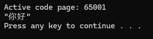

2. 使用txt编辑器，保存时选择ANSI编码格式    
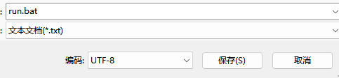

### 调用其他程序 start
标题一般空着，因为打开程序，是不会显示bat命令窗口的，设置标题也没地方展示
```bat
@echo off
start "bat标题" "D:\WeChat\WeChat.exe"
pause
```

### 输入内容 set /p
```bat
@echo off
set /p inp=请输入：
echo %inp%
pause
```

### bat函数声明
```bat
@echo off
:fun_main
	echo 这是个测试函数	
:fun_test
	echo 测试函数+1
pause
```
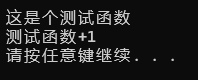

### goto标识符可用于函数跳转，其中特别的是goto :eof可用于停止往下继续执行命令行

:fun_test 函数将不再继续被执行，点击也会退出程序，结果如下：
```bat
@echo off
:fun_main
	echo 这是个测试函数
	pause
	goto :eof
:fun_test
	echo 测试函数+1
	pause
	goto :eof
pause
```
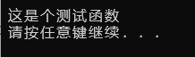


### call标识符也可用于调用函数，也可以调用别的bat脚本
```bat
@echo off
:fun_main
	echo 这是个测试函数
	call :fun_test
	pause
	goto :eof
:fun_test
	echo 测试函数+1
	goto :eof
pause
```
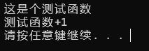


### if判断
+ == 等于
+ neq 不等于
+ gtr 大于
+ geq 大于等于
+ lss 小于
+ leq 小于等于

```bat
@echo off
set showMax=1
if %showMax%==1 (
    echo '相等'
) else (
    echo '不相等'
)
pause
```
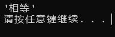

**注意：**
+ 使用变量，前后必须加上%。
+ 路径中有空格，使用双引号
+ 没有直接的转义字符，都是用双引号

## 技巧

### ping网段ip是否被使用
将1网段的ip全部ping完，文件存储在c:windowssystem32>文件中
```bat
for /l %D in (1,1,255) do (ping 192.168.1.%D -n 1 && echo 192.168.1.%D>>ok.txt || echo 192.168.1.%D >>no.txt)
```

### 使用bat脚本批量提取文件夹下所有的文件名
```bat
 dir *.*/b>a.xlsx
```


### 隐藏窗口后台运行指令
```js
@echo off
if "%1"=="h" goto begin
start mshta vbscript:createobject("wscript.shell").run("""%~nx0"" h",0)(window.close)&&exit
:begin
// 自定义运行的可执行程序的代码放在此处
```
+ 如果要关闭窗口，只能在控制台进行关闭，或者电脑关机。