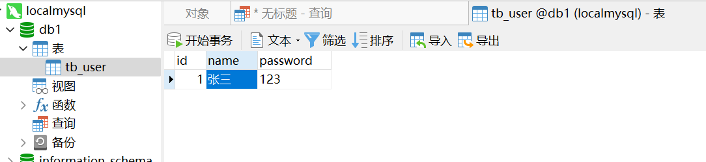
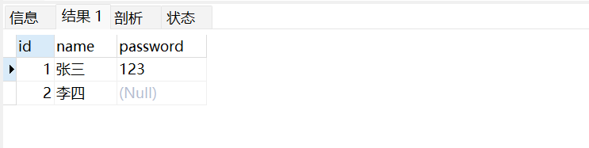
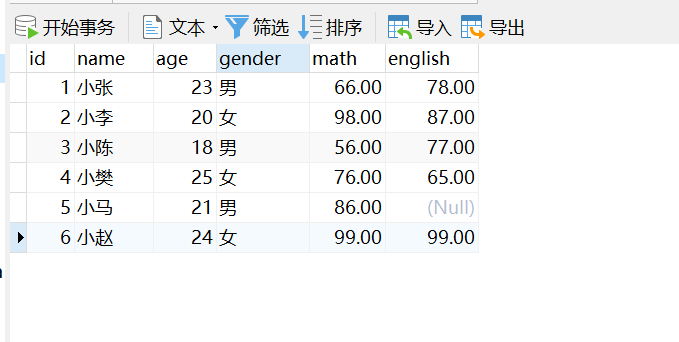
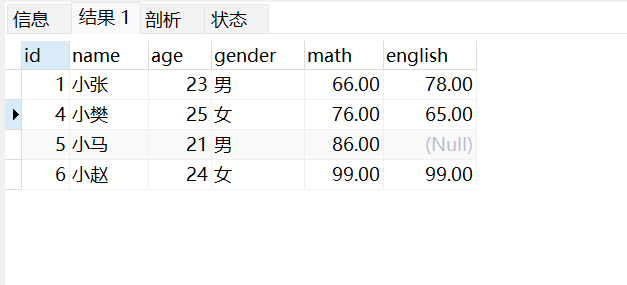
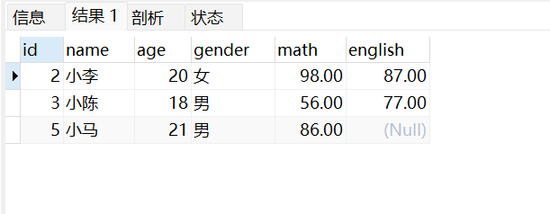
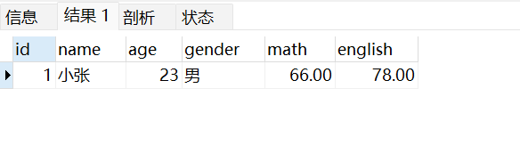
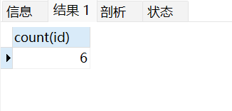
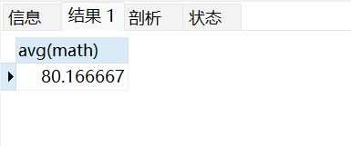
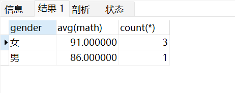
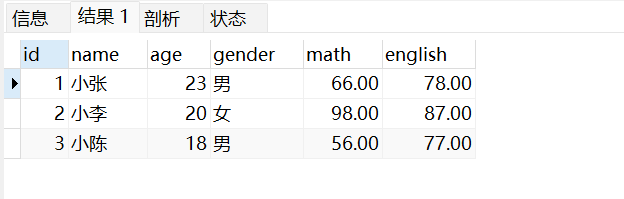

>  这是一篇硬核的MySql学习笔记，适合MySql小白。
> https://blog.csdn.net/zhangxia_/article/details/128731415
## SQL分类

DDL:数据库定义语言,用来定义数据库对象：数据库，表，列等。
DML:数据库操纵语言,用来对数据库中表的记录进行更新。
DQL:数据库查询语言,用来查询数据库中表的记录。
DCL:数据库控制语言,用来定义数据库的访问权限和安全级别，及创建用户。

1. 查询所有的数据库

```sql
    SHOW DATABASES;
    # 使用上面的方式查询出来的数据库中，有一个数据库的名字叫"mysql"，这个数据库是系统自带的数据库，不能删除。 
```

2. 创建数据库
```sql
    CREATE DATABASE 数据库名称;
    # 使用上面的方式创建数据库，数据库的名称不能重复。如果重复，会报错。所以，在创建数据库之前，先查询一下，该数据库是否存在。
    # 创建新数据库（判断是否存在）
    CREATE DATABASE IF NOT EXISTS 数据库名称;
```

3. 删除数据库
```sql
    DROP DATABASE 数据库名称;
    # 删除数据库之前，先判断该数据库是否存在。如果不存在，会报错。所以，在删除数据库之前，先查询一下，该数据库是否存在。
    # 删除数据库（判断是否存在）
    DROP DATABASE IF EXISTS 数据库名称;
```
4. 使用数据库
```sql
    USE 数据库名称;
    查询当前正在使用的数据库
    SELECT DATABASE();
```

## DDL-操作数据表

1. 数据类型

    数值：

    | 数据类型 | 解释|
    | ---- | ---- |
    |  tinyint | 小整数型，占一个字符 |
    | int | 大整数型，占4个字符 |
    | double | 双精度浮点类型 |

    日期：

    | 数据类型 | 解释|
    | ---- | ---- |
    | date | 日期值，只包含年月日|
    | datetime | 日期+时间|

    字符串：

    | 数据类型 | 解释|
    | ---- | ---- |
    | char | 定长字符串|
    | varchar | 变长字符串|

    备注：定长字符串和变长字符串的区别在于，定长字符串不管存入多少字符，都会占用固定的空间。而变长字符串，存入多少字符，就占用多少空间。优点：定长字符串的查询效率高。

2. 查询表

    查询当前数据库下所有的表
    ```sql
        SHOW TABLES;
    ```
    查询表结构
    ```sql
        DESC 表名称;
    ```

3. 创建表

    ```sql
        CREATE TABLE 表名称(
            列名称1 数据类型1,
            列名称2 数据类型2,
            ...
        );
    ```

4. 删除表

    ```sql
        DROP TABLE 表名称;
        # 删除表（判断是否存在）
        DROP TABLE IF EXISTS 表名称;
    ```

5. 修改表

    修改表名
    ```sql
        ALTER TABLE 旧表名 RENAME TO 新表名;
    ```

    增加一列
    ```sql
        ALTER TABLE 表名称 ADD 列名称 数据类型;
    ```

    修改数据类型
    ```sql
        ALTER TABLE 表名称 MODIFY 列名称 新数据类型;
    ```

    修改列名和数据类型
    ```sql
        ALTER TABLE 表名称 CHANGE 旧列名 新列名 新数据类型;
    ```

    删除列
    ```sql
        ALTER TABLE 表名称 DROP 列名称;
    ```


## 实战案例详解

需求：设计包含如下信息的学生表，请注重数据类型，长度的合理性

+ 编号
+ 姓名，姓名最长不超过10个汉字
+ 性别，因为取值只有两种可能，因此最多一个汉字
+ 生日，取值为年月日
+ 成绩，小数点后保留两位
+ 地址，最大长度不超过 64
+ 学生状态（用数字表示，正常、休学、毕业…）

在完成这样一个案例前，首先要创建一个学生数据库，在数据库中创建一张新的表，创建表时注意语法格式，数据类型和长度的合理性。

```sql
    # 创建学生信息数据库
    CREATE DATABASE IF NOT EXISTS 学生信息表;

    # 使用学生信息数据库
    USE 学生信息表;
    # 创建学生信息表
        create table 学生表(
            id int , --编号
            name varchar(10), --姓名
            gender char(1), --性别
            birthday date, --生日
            score double(5,2), --分数
            addr varchar(64), --地址
            status tinyint --状态
```

** 接下来，在Navicat中新建数据库，新建查询，我们就可以编写SQL并且执行SQL语句了。** 

## DML-增删改数据
1. 添加数据
    ```sql
    # 给指定列添加数据
    insert into 表名(列名1,列名2,列名3...) values(值1,值2,值3...);

    # 给全部列添加数据
    insert into 表名 values(值1,值2,值3...);

    # 批量添加数据
    insert into 表名(列名1,列名2,列名3...) values(值1,值2,值3...),(值1,值2,值3...),(值1,值2,值3...);

    # 批量添加数据（省略字段号）
    # 在开发过程中不建议使用，因为这样会降低SQL语句的执行效率，也降低了可读性
    insert into 表名 values(值1,值2,值3...),(值1,值2,值3...),(值1,值2,值3...);

    #查询表中的所有数据
    select * from 表名;
    ```

    **需求：往下tb_user表中添加一条数据**
    

    ```sql
    insert into tb_user(id,name) values(1,'张三');
    ```

2. 修改数据
    ```sql
    # 修改表中指定列的数据
    update 表名 set 列名1=值1,列名2=值2,列名3=值3... where 条件;
    ```
     在修改数据时，也可以不使用where条件，此时的操作时修改整列数据，这样的操作是很危险的。
     **需求：把下面tb_user表中的张三的密码改为abc23**
         
         ```sql
         update tb_user set password ='abc23' where name='张三'
         ```

3. 删除数据

    ```sql
    # 删除表中指定列的数据
    delete from 表名 where 条件;
    ```
    在删除某条数据时，如果不适用where条件，将会导致删除整个表的数据
    **需求：删除tb_user表中李四的记录**

## DQL-查询数据

查询是数据库中最核心的功能，也是我们使用最多的功能。
1. 查询所有列

    ```sql
        select
            字段列表
        from
            表名列表
        where
            条件列表
        group by
            分组字段
        having
            分组后的条件
        order by
            排序
        limit
            分页限定    
    ```
下面的练习中使用以下的案例学习单表查询
```sql
-- 删除stu表
drop table if exists stu;
-- 创建stu表
CREATE TABLE stu (
id int, -- 编号
name varchar(10), -- 姓名
age int, -- 年龄
gender varchar(5), -- 性别
math double(5,2), -- 数学成绩
english double(5,2) -- 英语成绩

);
-- 添加数据
INSERT INTO stu(id,name,age,gender,math,english)
VALUES
(1,'小张',23,'男',66,78),
(2,'小李',20,'女',98,87),
(3,'小陈',55,'男',56,77),
(4,'小樊',20,'女',76,65),
(5,'小马',20,'男',86,NULL),
(6,'小赵',57,'男',99,99);

```

在Navicat中选中SQL并执行：


### 基础查询
1. 基础查询语法
    ```sql
    # 查询多个字段：
    select 字段1,字段2,字段3... from 表名;
    # 查询所有字段：
    select * from 表名;
    # 去除重复记录
    select distinct 字段名 from 表名;
    # 起别名操作：
    select 字段名 as 别名 from 表名;
    ```

2. 基础查询语法练习
    ```sql
    # 查询多个字段的练习
    select id,name from stu;
    # 起别名操作
    select id as 编号,name as 姓名 from stu;
    ```

### 条件查询
1. 条件查询语法
```sql
    select 字段列表 from 表名 where 条件列表;
```
条件查询一般配合运行符使用，常用的运行符如下：

| 运算符 | 功能 |
| :------: | :------: |
| > < = ! | 大于 小于 等于 不等于 |
| between ... and ... | 在某个范围内 |
| in(set) | 在某个集合中 |
| is null / is not null | 是空值/不是空值 |
| and 或 && | 并且 |
| or 或 \|\| | 或者 |

2. 条件查询练习
查询年龄大于20的学员信息
```sql
    select * from stu where age > 20;
```


查询年龄等于18岁 或者 年龄等于20岁 或者年龄等于21岁的学生信息
```sql
    select * from stu where age in(18,20,21)
```

模糊查询使用like关键字，可以使用通配符进行占位
+ _ :代表单个任意字符
+ % :代表多个任意字符

查询姓张的学员信息
```sql
    select * from stu  where name like '张%';
```


### 排序查询
1. 排序查询语法
```sql
    select 字段列表 from 表名 order by 字段1 排序方式1, 字段2 排序方式2;
```
注： 排序方式
+ ASC : 升序，默认的
+ DESC : 降序   

2. 排序查询练习
查询学生信息，按照数学成绩降序排列
```sql
    select * from stu order by math desc;
```

### 聚合函数
1. 聚合函数语法

| 函数 | 功能 |
| :------: | :------: |
| count(列名) | 计算个数 |
| sum(列名) | 计算总和 |  
| max(列名) | 计算最大值 |
| min(列名) | 计算最小值 |
| avg(列名) | 计算平均值 |
一般语法：
select 聚合函数(列名) from 表名;
注：NULL值不参与聚合函数运算

2. 聚合函数练习

统计该表一共有几个学生
```sql
    select count(id) from stu;
```


上面我们使用某一字段进行运算，这样我们可能面对的问题是某一个值可能是null，所以我们一般使用 * 进行运算， 因为这一行中不可能所有的字段都是null
```sql
    select count(*) from stu;   
```
查询数学成绩的平均值
```sql
    select avg(math) from stu;
```


### 分组查询
1. 分组查询语法
```sql
    select 字段列表 from 表名 [where 筛选条件] group by 分组的字段名 [having 分组后的条件过滤];
``` 

注：分组之后，查询的字段为聚合函数和分组字段，查询其他字段无任何意义    

2. 分组查询练习

查询男女同学各自的数学平均分，以及各自人数，要求:分数低于70分的不参与分组。
```sql
    select gender,avg(math),conut(*) from stu where math > 70 group by gender;
```


注：where和having的执行时机不一样：where是分组之前进行限定，不满足where条件，则不参与分组，而having是分组之后会结果进行过滤，所以。where不能对聚合杉树进行判断，having可以。

### 分页查询
1. 分页查询语句
```sql
    select 字段列表 from 表名 limit 起始索引,查询记录数;
```
注：起始索引从0开始，起始索引 = （查询页码 - 1）* 每页显示

2. 分页查询练习
从0开始，查询3条数据
```sql
    select * from stu limit 0,3;
```



在sql标准中，一共规定了6种不同的约束，包括非空约束，唯一约束，主键约束，外键约束，检查约束，默认约束。

### 约束的概念
约束是作用于表中列上的规则，用于限制加入表的数据。例如，作为主键的列一定是非空的唯一的，否则将无法对数据进行区分。约束的存在保证了数据库中数据的正确性、有效性和完整性。所以约束在数据库设计中是非常重要的。

### 约束的分类
| 约束类型 | 描述 |
| :------: | :------: |
| NOT NULL | 非空，该字段的值不能为空 |
| UNIQUE | 唯一，该字段的值必须唯一 |
| PRIMARY KEY | 主键，非空且唯一，一个表只能有一个字段为主键 |
| FOREIGN KEY | 外键，用于限制两个表的关系，要求：1. 字段需要设置为key 2. 字段需要设置引用 |
| CHECK | 检查约束，mysql中不支持 |
| DEFAULT | 默认值，当插入数据时，如果不给该字段赋值，则自动赋予默认值 |

### 非空约束
```sql
    # 添加约束：
    create table 表名(
        列名 数据类型 not null,
        ...
    );
    # 建完表后添加非空约束
    alter table 表名 modify 列名 数据类型 not null;
    # 删除非空约束
    alter table 表名 modify 列名 数据类型;
```

### 唯一约束
```sql
    create table 表名(
        列表 数据类型 unique [auto_increment]
    );
    create table 表名(
        列表 数据类型,
        ...
        [constraint] [约束名称] unique(列名)
    );
    # 建完表后添加唯一约束
    alter table 表名 modify 字段名 数据类型 unique;
    # 删除唯一约束
    alter table 表名  drop index 列名;
```

### 主键约束
目的：主键是一行数据的唯一标识，要求非空且唯一
```sql
    create table 表名(
        列表 数据类型 primary key [auto_increment],
        ...
    );
    # 建完表后添加主键约束
    alter table 表名 add primary key(列名);
    # 删除主键约束
    alter table 表名 drop primary key;
```

### 默认约束
目的：保存数据时，如果未给该字段赋值，则自动赋予默认值
```sql 
    create table 表名(
        列表 数据类型 default 默认值,
        ...
    );
    # 建完表后添加默认约束
    alter table 表名 alter 列名 set default 默认值;
    # 删除默认约束
    alter table 表名 alter 列名 drop default;
```

### 外键约束
目的：外键用来让两个表的数据之间建立链接，保证数据的一致性和完整性
```sql
    create table 表名(
        列表 数据类型,
        ...
        [constraint] [外键名称] foreign key(外键列名) references 主表名(主表列名)
    );
    # 建完表后添加外键约束
    alter table 表名 add constraint 外键名称 foreign key(外键列名) references 主表名(主表列名);
    # 删除外键约束
    alter table 表名 drop foreign key 外键名称;
```
### 